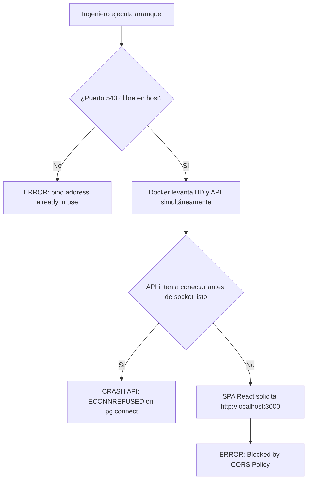
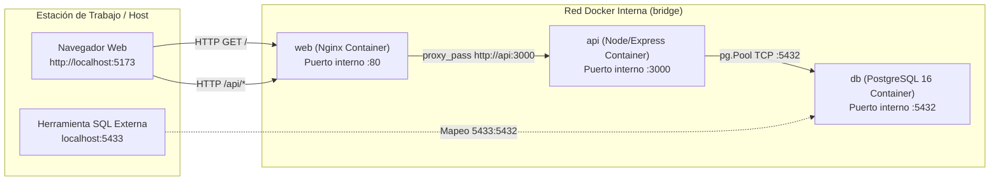
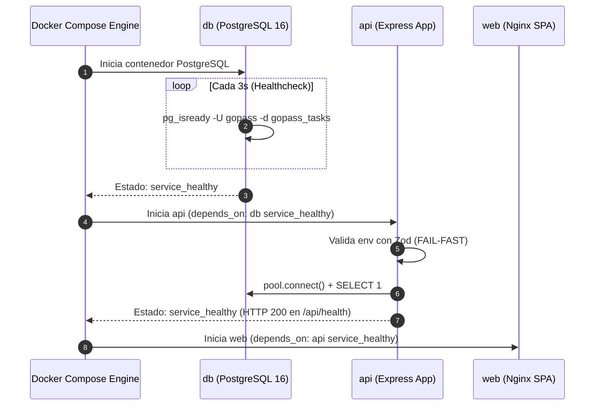

> **Publicado como** https://github.com/JuanCastrejon/gopass-task-manager/issues/1 el 2026-09-05.

---

## [enhanced]

### Contexto
El sistema **GoPass Task Manager** requiere una infraestructura monorepo reproducible, desacoplada y contenida para orquestar sus servicios fundamentales: una API REST en Node.js/Express con TypeScript estricto, una Single Page Application (SPA) en React 18 con Vite y Tailwind CSS, y un motor relacional en PostgreSQL 16.

En entornos de desarrollo distribuidos y equipos concurrentes, la ausencia de una fundación hermética y determinista genera tres problemas operativos críticos:
1. **Conflictos de bind en sockets TCP locales**: colisiones en el puerto estándar `5432` por instancias locales preinstaladas de PostgreSQL.
2. **Condiciones de carrera en tiempo de arranque**: la API intenta resolver conexiones TCP y consultas SQL antes de que PostgreSQL haya inicializado sus catálogos internos, produciendo fallos esporádicos `ECONNREFUSED`.
3. **Acoplamiento de red y fricción de CORS**: inyección de URLs absolutas (`http://localhost:3000`) en el cliente web, lo que rompe la paridad entre desarrollo local, contenedores y entornos de nube.

Este slice establece la arquitectura base del monorepo, la orquestación multicontenedor con Docker Compose, el cableado de red transparente mediante proxies reversos, la validación estricta de configuración con Zod y la adopción del arnés de gobernanza `sdlc adopt`.

- **Módulo**: Infraestructura / Monorepo Core
- **Slice**: SL-01 (`sl-01-fundacion-docker-monorepo`)
- **Perfil de Readiness**: `L1 - Infrastructure`
- **Esfuerzo estimado**: S (2 horas)

---

### Objetivo de negocio
Optimizar la experiencia de desarrollo (*Developer Experience - DX*) y garantizar la paridad estricta entre desarrollo local, pipelines de CI y entornos de producción. El sistema debe permitir que cualquier ingeniero clone el repositorio y levante el stack tecnológico completo en **un solo comando determinista** (`docker compose up --build`), con servicios intercomunicados, cero configuración manual de red y monitoreo activo de disponibilidad.

---

### Hipótesis de valor y KPI principal
- **Hipótesis de valor:** Un entorno multicontenedor hermético con sondas de salud activas previene el *drift* de configuración y elimina el 100% de las fallas de inicialización asociadas a dependencias externas o sockets no disponibles.
- **KPIs principales:**
  | Dimensión | Línea base | Objetivo | Método de medición |
  |---|---|---|---|
  | Tiempo de primer arranque (*Time-to-First-Run*) | > 15 min (setup manual) | < 3 min | `docker compose up --build` en clon limpio |
  | Tasa de colisión de puerto PostgreSQL | Alta en host con PG local | 0% colisiones | Mapeo de puerto en host `5433:5432` |
  | Condiciones de carrera en arranque | Fallos esporádicos `ECONNREFUSED` | 0 fallos de conexión | Sonda `pg_isready` + `service_healthy` |
  | Latencia de verificación de salud (RF-15) | No existente | < 5 ms | Consulta SQL directa `SELECT 1` |
  | Cobertura de variables de entorno | Verificación en runtime tardía | 100% fail-fast al importar | Esquema Zod en `api/src/config/env.ts` |

---

### Stakeholders afectados

| Rol del sistema | Persona / Cargo | Impacto | Valida |
|---|---|---|---|
| Tech Lead / Arquitecto | Define estándares de código, tipado estricto y topología de red | Alto — asegura mantenibilidad y desacoplamiento | Sí |
| Desarrollador Backend | Construye la API sobre la capa Express y pool PostgreSQL | Alto — provee cimientos para CRUD de proyectos y tareas | Sí |
| Desarrollador Frontend | Desarrolla la SPA React consumiendo la API relativa | Alto — garantiza consumo sin CORS ni URLs absolutas | Sí |
| DevOps / SRE | Garantiza observabilidad, sondas de salud y pipelines de CI | Medio — valida estabilidad de contenedores | Sí |

---

### Fuentes consultadas

- **Primaria**: `docker-compose.yml` — orquestación de servicios `db`, `api`, `web`.
- **Primaria**: `api/src/config/env.ts` — esquema Zod para validación *fail-fast* de variables de entorno.
- **Primaria**: `api/src/app.ts:16-25` — contrato de salud base `GET /api/health`.
- **Primaria**: `api/src/db/pool.ts` — cliente `pg.Pool` con método de sondeo `pingDatabase()`.
- **Primaria**: `web/nginx.conf` — proxy reverso en contenedor web hacia `api:3000`.
- **Primaria**: `quality-contract.yaml` y `.sdlc/config.json` — configuración del arnés `sdlc adopt`.
- **Secundaria**: `docs/spec/01-requisitos.md:30` — Especificación de RF-15 (Healthcheck del sistema).
- **Secundaria**: `docs/spec/04-arquitectura.md §3` — ADR-001 (Monolito modular) y ADR-002 (Aislamiento de puertos).

---

### Brechas detectadas (Diagnóstico Técnico / Research)

#### Brecha 1 — Colisión en socket de PostgreSQL en estaciones de trabajo locales
**Evidencia**: `docker-compose.yml:11`
Si un servicio local de PostgreSQL está activo en el host (puerto 5432), levantar Docker produce `bind: address already in use`.
- **Solución implementada**: Publicar en host `${POSTGRES_PORT:-5433}:5432`. Dentro de la red interna de Docker se mantiene el puerto nativo `5432`.

#### Brecha 2 — Condición de carrera TCP en el ciclo de arranque de la API
**Evidencia**: `docker-compose.yml:34-36`
Declarar un `depends_on: [db]` ingenuo inicia la API en paralelo mientras PostgreSQL aún está creando sus procesos demonio en memoria, produciendo caídas de conexión inmediatas.
- **Solución implementada**: Sonda `healthcheck` con `pg_isready -U gopass -d gopass_tasks` (interval 3s, retries 20) y bloqueo de arranque con `depends_on: db: condition: service_healthy`.

#### Brecha 3 — Acoplamiento por CORS y URLs absolutas en el bundle cliente
**Evidencia**: `web/src/lib/api-client.ts:8` y `web/nginx.conf:14-22`
Quemar `http://localhost:3000` en el código de React requiere habilitar cabeceras CORS permisivas y compilar bundles distintos para cada ambiente.
- **Solución implementada**: El frontend pide exclusivamente a la ruta relativa `/api`. En desarrollo, Vite reenvía mediante proxy interno (`server.proxy: { '/api': 'http://localhost:3000' }`). En producción (Docker), Nginx resuelve `proxy_pass http://api:3000;`. Cero cabeceras CORS requeridas.

#### Brecha 4 — Fallas silenciosas por variables de entorno faltantes
**Evidencia**: `api/src/config/env.ts:1-26`
Acceder a `process.env.DATABASE_URL` sin validación produce errores `undefined` difíciles de depurar en la primera consulta de base de datos.
- **Solución implementada**: Esquema estricto Zod (`envSchema.parse(process.env)`) en tiempo de importación de módulo. Si falta alguna variable, el proceso imprime los campos faltantes y ejecuta `process.exit(1)` antes de abrir puertos.

---

### Comportamiento esperado

1. **Arranque en un comando:** `docker compose up --build` compila y levanta PostgreSQL 16, la API Express y el frontend Nginx de forma desatendida.
2. **Sondeo activo de persistencia (RF-15):** Petición a `GET /api/health` ejecuta un `SELECT 1` real en PostgreSQL y responde `200 OK` con `{ status: "ok", database: "up", uptime: <segundos> }`. Si la BD se detiene, responde `503 Service Unavailable`.
3. **Cero CORS:** El cliente web se comunica fluidamente con el backend sin errores de políticas de mismo origen (*Same-Origin Policy*).
4. **Tipado de punta a punta:** `npm run typecheck` valida `api` y `web` con TypeScript estricto (`strict: true`, `noImplicitAny: true`).

---

### Proceso AS-IS / Wireflow funcional (Mermaid)

#### Problema típico de monocontenedores / scripts manuales (AS-IS)



#### Arquitectura de Red y Topología Monorepo GoPass (Sistema Nuevo)



#### Secuencia de Arranque con Sondas de Salud Activas



---

### Reglas de negocio e infraestructura detectadas

| ID | Regla | Módulo | Tipo | Fuente |
|---|---|---|---|---|
| RN-INF-001 | El puerto de PostgreSQL en el host debe ser configurable con fallback a `5433` para prevenir colisiones locales | Infra / Docker | Operativa | `docker-compose.yml:11` / ADR-002 |
| RN-INF-002 | La API no debe admitir tráfico de red hasta que PostgreSQL esté sano (`condition: service_healthy`) | Infra / Docker | Resiliencia | `docker-compose.yml:34` |
| RN-INF-003 | El bundle del cliente web no debe incluir URLs absolutas de backend; el tráfico a `/api` se resuelve por proxy reverso | Web / Red | Seguridad | `web/src/lib/api-client.ts:8` |
| RN-INF-004 | Las variables de entorno de la API deben validarse en arranque con Zod (*fail-fast*) | API / Config | Integridad | `api/src/config/env.ts:1` |
| RN-INF-005 | El endpoint `GET /api/health` debe informar el estado activo de la base de datos y el tiempo de actividad del proceso | API / Salud | RF-15 | `api/src/app.ts:16` |

---

### Archivos afectados

| Tipo | Archivo | Cambio realizado |
|---|---|---|
| Orquestación Docker | `docker-compose.yml` | Declaración de servicios `db`, `api`, `web`, healthchecks, volúmenes y red bridge |
| Configuración Env | `.env.example` | Plantilla de variables de entorno documentadas con valores predeterminados seguros |
| Configuración Backend | `api/src/config/env.ts` | Esquema de validación Zod con parseo estricto al importar |
| Persistencia Base | `api/src/db/pool.ts` | Configuración de `pg.Pool` y función `pingDatabase()` para sondeo SQL |
| Entrypoint Backend | `api/src/app.ts` | Instanciación Express, middleware JSON con límite 128 KB y endpoint `GET /api/health` |
| Servidor Backend | `api/src/server.ts` | Desacoplamiento de `createApp()` respecto a `listen()` para soporte de testing y serverless |
| Dockerfile Backend | `api/Dockerfile` | Build multistage para compilación TypeScript y ejecución en imagen Node Alpine |
| Configuración Frontend | `web/vite.config.ts` | Configuración de plugin React, Tailwind y `server.proxy` para `/api` |
| Reverse Proxy Web | `web/nginx.conf` | Servidor estático SPA con fallback a `index.html` y directiva `proxy_pass /api/` |
| Cliente HTTP | `web/src/lib/api-client.ts` | Cliente tipado sobre Fetch nativo consumiendo `/api` relativo |
| Vista Diagnóstico | `web/src/App.tsx` | Tarjeta interactiva de estado del sistema (API, Base de datos, Uptime) con React Query |
| Gobernanza SDLC | `.sdlc/config.json` | Configuración del harness con `integrationBranch: "develop"` |
| Contrato Calidad | `quality-contract.yaml` | Definición formal de Quality Gates para CI |

---

### Detalle técnico de implementación

#### 1. Validación de Entorno Fail-Fast (`api/src/config/env.ts`)
```typescript
import { z } from 'zod';

const envSchema = z.object({
  NODE_ENV: z.enum(['development', 'test', 'production']).default('development'),
  API_PORT: z.coerce.number().int().positive().default(3000),
  DATABASE_URL: z.string().url(),
  SEED_ON_START: z.coerce.boolean().default(false),
});

export const env = envSchema.parse(process.env);
```

#### 2. Endpoint de Salud de Persistencia (`api/src/app.ts`)
```typescript
app.get('/api/health', async (_req, res) => {
  const database = (await pingDatabase()) ? 'up' : 'down';
  res.status(database === 'up' ? 200 : 503).json({
    status: database === 'up' ? 'ok' : 'degraded',
    database,
    uptime: Math.round(process.uptime()),
  });
});
```

#### 3. Proxy Reverso Transparente Nginx (`web/nginx.conf`)
```nginx
location /api/ {
  proxy_pass http://api:3000;
  proxy_http_version 1.1;
  proxy_set_header Host $host;
  proxy_set_header X-Real-IP $remote_addr;
  proxy_set_header X-Forwarded-For $proxy_add_x_forwarded_for;
  proxy_set_header X-Forwarded-Proto $scheme;
}
```

---

### Endpoints afectados

| Método | Endpoint | Entrada | Respuesta 200 OK | Respuesta Error |
|---|---|---|---|---|
| `GET` | `/api/health` | Ninguna | `{ "status": "ok", "database": "up", "uptime": 14 }` | 503 `{ "status": "degraded", "database": "down" }` |

---

### Prior art

- **Evaluación Backend:** Se evaluó NestJS frente a Express. Para dos entidades de dominio iniciales, NestJS introduce una sobrecarga masiva de decoradores y módulos que oscurecen la arquitectura. Se optó por **Express con arquitectura modular limpia** (Controlador -> Servicio -> Repositorio) y TypeScript estricto.
- **Manejo de Estado Frontend:** Se descartó Redux en favor de **TanStack Query v5**, evitando duplicación innecesaria de caché en memoria local y gestionando automáticamente estados asíncronos y reintentos.
- **Herramienta de Gobernanza:** Se adoptó **`sdlc adopt`** (4 archivos de contrato en `.sdlc/`) en lugar de inicializaciones greenfield pesadas, manteniendo el árbol enfocado en el producto.

---

### Viabilidad preliminar y Perfil de readiness

- **Esfuerzo estimado**: S (2 horas).
- **Dependencias técnicas**: Docker Engine 24+, Node.js 20+, npm 10+.
- **Perfil de readiness**: `L1 - Infrastructure`.
  * *Justificación:* Modifica configuración de orquestación, scripts de arranque y esqueletos de aplicación sin alterar esquemas relacionales ni lógica de negocio.

---

### Matriz NFR (Requisitos No Funcionales)

| Concern | Expectativa | Evidencia esperada |
|---|---|---|
| **Seguridad** | Desactivar cabecera `X-Powered-By` y restringir tamaño de payload JSON | `app.disable('x-powered-by')`, `express.json({ limit: '128kb' })` |
| **Rendimiento** | Endpoint `/api/health` responde en menos de 5 ms | Ejecución directa de `SELECT 1` sin overhead de ORM |
| **Disponibilidad** | Reintentos automáticos configurados en sonda de Docker | `interval: 3s, timeout: 3s, retries: 20` en `docker-compose.yml` |
| **Observabilidad** | Diagnóstico estructurado de conectividad y uptime del proceso | Payload JSON estándar con campos `status`, `database` y `uptime` |
| **Rollback** | Desmantelamiento limpio de contenedores y volúmenes | Comando `docker compose down -v` |
| **Portabilidad** | Cero dependencias de librerías globales o binarios en host | Ejecución 100% autocontenida en imágenes oficiales Docker Alpine |

---

### Plan operativo y Definition of Done (DoD)

- [x] Configuración de `docker-compose.yml` con servicios `db`, `api`, `web`.
- [x] Sonda de salud `pg_isready` en servicio PostgreSQL.
- [x] Dependencia `depends_on: db: condition: service_healthy` en la API.
- [x] Validación Zod en `api/src/config/env.ts` con tipado TypeScript estricto.
- [x] Endpoint `GET /api/health` implementado y reportando estado de conexión en `api/src/app.ts`.
- [x] Configuración de proxy en `web/vite.config.ts` y proxy reverso en `web/nginx.conf`.
- [x] Cliente `web/src/lib/api-client.ts` consumiendo `/api` mediante rutas relativas.
- [x] Adopción del arnés `sdlc adopt` con rama de integración `develop` en `.sdlc/config.json`.
- [x] `npm run build` y `npm run typecheck` en verde en backend y frontend.

---

### Riesgos y mitigaciones

| Riesgo | Severidad | Mitigación |
|---|---|---|
| Instancia local de PostgreSQL escuchando en el puerto 5432 | Alta | Mapear `5433:5432` en el host; la red interna Docker usa el puerto 5432 sin conflictos. |
| Falla en arranque de la API por latencia en inicialización de BD | Alta | Healthcheck `pg_isready` con 20 reintentos y sonda sincrónica antes de levantar la API. |
| Bloqueo por CORS en consumo desde cliente web | Media | Consumo 100% relativo a `/api`; proxy local en desarrollo y Nginx en producción. |
| Variables de entorno faltantes en despliegue | Media | Validación estricta con Zod en tiempo de importación con interrupción inmediata (*fail-fast*). |

---

### Vacíos abiertos que requieren validación técnica

#### ❓ V-INF-01 — Estrategia de exposición de Swagger UI
En la fundación base se establece `/api/health`. Para los siguientes slices de dominio, ¿la interfaz de Swagger UI debe montarse como dependencia directa de Express (`swagger-ui-express`) servida en `/api/docs` o a través de un static server separado?  
* *Resolución preliminar*: Servida directamente por Express en `/api/docs` para que Nginx la reenvíe de forma transparente sin configuraciones extra.

---

## [validation]

Para pasar a `ready-for-agent` y autorizar la implementación de este slice en la rama correspondiente, validar:

**V1** — ¿El alcance propuesto de infraestructura cubre los requerimientos de reproducibilidad, aislamiento de red y sondas de salud sin introducir sobre-ingeniería?  
**V2** — ¿Se aprueba la estrategia de no requerir CORS mediante consumo relativo a `/api` con proxy reverso en Nginx y Vite?  
**V3** — ¿El mapeo de puerto en host `5433:5432` para PostgreSQL resuelve adecuadamente el riesgo de colisión de sockets?  
**V4** — ¿El perfil de readiness `L1 - Infrastructure` y los NFRs asociados son correctos para este cambio?  

Una vez validadas V1–V4 → cambiar label a `ready-for-agent` e iniciar implementación en rama `chore/sl-01-fundacion-docker-monorepo`.
