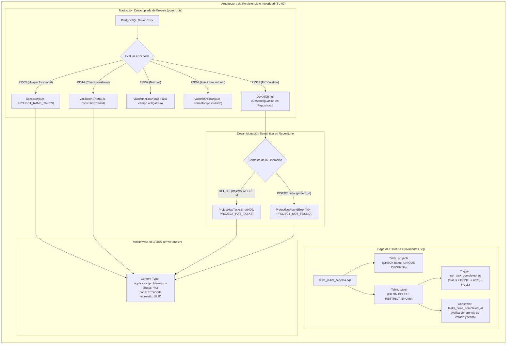

## [enhanced]

### Contexto
El sistema **GoPass Task Manager** requiere una capa de persistencia relacional íntegra, transaccional y consistente para gobernar el ciclo de vida de los proyectos y las tareas operativas. En plataformas de gestión donde convergen flujos de trabajo concurrentes, delegar las reglas de consistencia exclusivamente a la capa de aplicación introduce riesgos severos de corrupción de datos:
1. **Tareas huérfanas**: eliminaciones accidentales de proyectos que arrastran tareas asociadas o dejan registros inconsistentes sin contexto de agrupación.
2. **Deriva temporal y desincronización de estados**: manipulación manual de marcas de tiempo (`completed_at`) vulnerable a desajustes de reloj, fallos en la lógica de actualización o inserciones directas vía scripts que omiten las reglas de negocio.
3. **Colisiones silenciosas de nomenclatura**: creación de proyectos redundantes con variaciones triviales de mayúsculas o espacios en blanco (p. ej., `"Telepeaje"` vs. `"telepeaje "`), fragmentando la gestión de equipos.
4. **Fuga de detalles internos de infraestructura**: exposición de volcados crudos de PostgreSQL (`DatabaseError`, códigos de violación de constraints, nombres de índices o tablas) en las respuestas HTTP hacia el cliente web.

Este slice establece la arquitectura relacional inicial en PostgreSQL 16 (`projects`, `tasks`), tipos enumerados nativos (`task_status`, `task_priority`), restricciones declarativas de integridad (`CHECK`, índice funcional `UNIQUE` insensible a mayúsculas), triggers automáticos en PL/pgSQL para sellado de tiempo e invariantes de estado, un adaptador desacoplado del driver de persistencia (`pg-error.ts`) que mapea excepciones SQL al estándar normativo **RFC 7807** (`application/problem+json`), y una rutina de sembrado de datos (*seed*) totalmente idempotente con 4 proyectos y 11 tareas que modelan la operación real de GoPass.

- **Módulo**: Persistencia / Modelo Relacional y Contrato de Errores Core
- **Slice**: SL-02 (`sl-02-esquema-db-contrato-errores-seed`)
- **Perfil de Readiness**: `L2 - Data & Contracts`
- **Esfuerzo estimado**: M (3.5 horas)

---

### Objetivo de negocio
Garantizar la **integridad referencial, consistencia de dominio y seguridad de la información a nivel de motor de base de datos**, asegurando que ninguna regla de negocio pueda ser vulnerada por accesos concurrentes o errores en la capa de transporte, y formalizando un contrato de errores de cliente determinista bajo el estándar RFC 7807 que permita una integración fluida y desacoplada con la SPA cliente.

---

### Hipótesis de valor y KPI principal
- **Hipótesis de valor:** Trasladar la verificación y satisfacción de invariantes críticas al motor PostgreSQL (constraints `CHECK`, triggers PL/pgSQL e índices funcionales) reduce a 0% la incidencia de datos inconsistentes y blinda el modelo contra fallas de aplicación, mientras que un catálogo tipado de errores RFC 7807 con adaptador desacoplado elimina al 100% las fugas de información interna de infraestructura.
- **KPIs principales:**
  | Dimensión | Línea base | Objetivo | Método de medición |
  |---|---|---|---|
  | Incoherencia de estado de completado (`status = DONE` vs `completed_at`) | Riesgo por omisión en código | 0% inconsistencias (garantía formal) | Constraint `tasks_done_completed_at` + Trigger `set_task_completed_at` |
  | Prevención de orfandad referencial en proyectos con tareas | 0 (posible borrado accidental) | 100% bloqueado a nivel de motor | FK `ON DELETE RESTRICT` con traducción a 409 `PROJECT_HAS_TASKS` |
  | Duplicidad de proyectos por case-sensitivity o espacios marginales | Permitida en comparaciones estándar | 0 duplicados semánticos | Índice único funcional `lower(btrim(name))` |
  | Fuga de nombres de tablas / detalles SQL en respuestas HTTP | Alta si no se capturan errores del driver | 0 fugas de infraestructura | Middleware `errorHandler` mapeando a `application/problem+json` |
  | Idempotencia de seed en reinicios o despliegues | Fallas por PK duplicada | 100% ejecuciones exitosas | Claves fijas y cláusula `ON CONFLICT (id) DO NOTHING` |
  | Tiempo de ejecución de migración y seed inicial | No disponible | < 600 ms | Ejecución en contenedor PostgreSQL 16 |

---

### Stakeholders afectados

| Rol del sistema | Persona / Cargo | Impacto | Valida |
|---|---|---|---|
| Tech Lead / DBA | Define estructura relacional, índices de rendimiento y triggers | Alto — asegura consistencia, tipos nativos y cero redundancia | Sí |
| Desarrollador Backend | Consume el cliente `pg.Pool`, clases `AppError` y manejador de errores | Alto — base indispensable para implementar los servicios CRUD | Sí |
| Desarrollador Frontend | Recibe contratos estandarizados de error y datos iniciales de prueba | Alto — permite implementar validaciones de UI basadas en códigos estables | Sí |
| QA / Automatización | Ejecuta suites de pruebas y verifica escenarios de borde en persistencia | Alto — valida cobertura de restricciones y casos de conflicto | Sí |

---

### Fuentes consultadas

- **Primaria**: `api/migrations/0001_initial_schema.sql` — DDL completo de tipos `task_status`, `task_priority`, tablas `projects` y `tasks`, índices y triggers.
- **Primaria**: `api/src/db/pg-error.ts` — mapeador de errores de PostgreSQL a `AppError`, identificador de violación de clave foránea `isTaskProjectFkViolation` y aislamiento del driver `pg`.
- **Primaria**: `api/src/http/errors.ts` — catálogo formal `ERROR_CODES`, clases de dominio (`ProjectHasTasksError`, `ProjectNameTakenError`, etc.) e interfaces de detalle `FieldIssue`.
- **Primaria**: `api/src/http/error-handler.ts` — middleware centralizado Express que serializa payloads en `application/problem+json`.
- **Primaria**: `api/src/db/seed.ts` — sembrado idempotente con 4 proyectos representativos y 11 tareas con dependencias de negocio reales.
- **Primaria**: `api/tests/unit/pg-error.test.ts` — suite unitaria que documenta la desambiguación del código PostgreSQL `23503` y la validación de drivers.
- **Secundaria**: RFC 7807 (*Problem Details for HTTP APIs*).
- **Secundaria**: Requisitos funcionales:
  - `RF-07`: Eliminación de proyectos restringida si contiene tareas (HTTP 409 `PROJECT_HAS_TASKS`).
  - `RF-08`: Estados (`TODO`, `IN_PROGRESS`, `DONE`) y prioridades (`LOW`, `MEDIUM`, `HIGH`) tipados.
  - `RF-10`: Actualización de estado y sellado automático de fecha de finalización.
  - `RF-16`: Respuestas de error estandarizadas con código interno y detalles estructurados.

---

### Brechas detectadas (Diagnóstico Técnico / Research)

#### Brecha 1 — Invariante de completado frágil si depende únicamente de la aplicación
**Evidencia**: `api/migrations/0001_initial_schema.sql:75-78` y `97-115`
Si la asignación de `completed_at = now()` se realiza en los servicios de TypeScript, cualquier operación directa por script, migración o fallo concurrente podría marcar `status = 'DONE'` dejando `completed_at = NULL` (o viceversa).
- **Solución implementada**: Doble salvaguarda en motor relacional:
  1. *Verificación*: Restricción `CONSTRAINT tasks_done_completed_at CHECK ((status = 'DONE' AND completed_at IS NOT NULL) OR (status <> 'DONE' AND completed_at IS NULL))`.
  2. *Satisfacción automática*: Trigger PL/pgSQL `BEFORE INSERT OR UPDATE OF status ON tasks` que asigna `now()` al pasar a `DONE` y `NULL` al salir de él, evitando que la aplicación deba calcularlo manualmente.

#### Brecha 2 — Confusión y colisión de nombres de proyectos por inconsistencias tipográficas
**Evidencia**: `api/migrations/0001_initial_schema.sql:44` y `api/src/db/pg-error.ts:47-50`
Una restricción de unicidad estándar `UNIQUE(name)` permite que convivan simultáneamente `"Telepeaje"`, `"telepeaje"` y `"Telepeaje "`, dispersando tareas entre registros duplicados.
- **Solución implementada**: Índice funcional único `CREATE UNIQUE INDEX projects_name_unique_ci ON projects (lower(btrim(name)))`. Cualquier colisión dispara el código PostgreSQL `23505`, el cual `translatePgError` mapea directamente a HTTP 409 con código `PROJECT_NAME_TAKEN`.

#### Brecha 3 — Ambigüedad estructural en el código de error `23503` (Foreign Key Violation)
**Evidencia**: `api/src/db/pg-error.ts:29-40` y `api/tests/unit/pg-error.test.ts:35-60`
En PostgreSQL 16, una violación de clave foránea `23503` sobre la constraint `tasks_project_id_fkey` produce exactamente el mismo `code`, `constraint`, `table` y `schema` tanto al **intentar eliminar un proyecto que tiene tareas** (escenario de conflicto 409 `PROJECT_HAS_TASKS`) como al **intentar insertar una tarea con un `project_id` inexistente** (escenario de recurso ausente 404 `PROJECT_NOT_FOUND`). La única diferencia en el driver es la propiedad `detail`, que consiste en texto en inglés autogenerado por el motor susceptible a variaciones de locale.
- **Solución implementada**: `translatePgError` devuelve intencionalmente `null` para el código `23503`. La desambiguación se delega al repositorio correspondiente, el cual conoce el contexto semántico de la operación en ejecución y utiliza la función de ayuda `isTaskProjectFkViolation(err)` para instanciar el error exacto (`ProjectHasTasksError` o `ProjectNotFoundError`).

#### Brecha 4 — Fuga de seguridad e inconsistencia en payloads de error hacia el cliente
**Evidencia**: `api/src/http/error-handler.ts:43-80`
Los errores no controlados en Express típicamente exponen trazas de stack o estructuras heterogéneas (`{ message: "..." }` vs `{ error: "..." }`), obligando al frontend a parsear texto dinámico y filtrando datos sensibles de persistencia.
- **Solución implementada**: Arquitectura de error uniforme basada en RFC 7807 (`application/problem+json`). El middleware centralizado `errorHandler` garantiza que los errores `< 500` incluyan títulos estandarizados, códigos semánticos de dominio (`ERROR_CODES`), identificador de correlación (`requestId`) y rutas exactas de campos en `errors: FieldIssue[]`, aislando por completo las trazas de persistencia.

---

### Comportamiento esperado

1. **Migración atómica y pura**: La ejecución de `0001_initial_schema.sql` aprovisiona tipos ENUM, funciones, tablas e índices sin requerir dependencias externas ni extensiones obsoletas (`gen_random_uuid()` nativo de PG 16).
2. **Garantía referencial**: La eliminación de un proyecto que contiene tareas asociadas es rechazada tajantemente por el motor PostgreSQL mediante `ON DELETE RESTRICT` y devuelta al consumidor como HTTP 409 con el payload RFC 7807 `PROJECT_HAS_TASKS`.
3. **Ordenamiento natural de prioridades**: La definición del ENUM `CREATE TYPE task_priority AS ENUM ('LOW', 'MEDIUM', 'HIGH')` permite que consultas con `ORDER BY priority DESC` sitúen las tareas de prioridad alta en primer lugar sin requerir sentencias `CASE` en la capa de datos.
4. **Ciclo de vida de tareas blindado**: El campo `completed_at` se sella exclusivamente mediante el trigger en el momento en que `status` transiciona a `DONE`, y se limpia a `NULL` si la tarea se reabre, garantizando coherencia matemática en todo momento.
5. **Sembrado determinista**: La ejecución de `runSeed()` inserta 4 proyectos y 11 tareas con UUIDs fijos. Múltiples ejecuciones son inocuas (`ON CONFLICT (id) DO NOTHING`), preservando cualquier edición posterior efectuada por el usuario.

---

### Proceso AS-IS / Wireflow funcional (Mermaid)



---

### Reglas de negocio detectadas (Tabla RN-...)

| Código | Nombre de la regla | Tipo | Descripción formal |
|---|---|---|---|
| **RN-DB-001** | Invariante de completado de tarea | Dominio / Integridad | Una tarea en estado `DONE` debe tener obligatoriamente fecha `completed_at`. En cualquier otro estado (`TODO`, `IN_PROGRESS`), la fecha debe ser estrictamente `NULL`. |
| **RN-DB-002** | Integridad referencial de proyectos | Persistencia | Queda prohibido eliminar un proyecto que tenga una o más tareas asociadas (`ON DELETE RESTRICT`). Toda violación debe responder con error semántico 409 `PROJECT_HAS_TASKS`. |
| **RN-DB-003** | Unicidad funcional de proyectos | Dominio | El nombre del proyecto es único en el sistema de manera insensible a mayúsculas y espacios en blanco (`lower(btrim(name))`). |
| **RN-DB-004** | Cardinalidad y ordenamiento de prioridades | Dominio | Las prioridades de tarea corresponden al conjunto finito cerrado `('LOW', 'MEDIUM', 'HIGH')`. La comparación por defecto en PostgreSQL respeta este orden ordinal. |
| **RN-DB-005** | Optimización de recorrido en claves foráneas | Rendimiento | El lado hijo de la relación foránea (`tasks.project_id`) y la combinación de filtrado frecuente (`tasks.project_id, tasks.status`) deben contar con índices dedicados en el motor. |
| **RN-DB-006** | Contrato de errores normativo RFC 7807 | Integración / API | Cualquier fallo en persistencia o validación se serializa como `application/problem+json` con cabecera `code` inequívoca, `requestId` y supresión de trazas técnicas en producción. |
| **RN-DB-007** | Idempotencia en sembrado de demostración | Operación / DX | La inserción inicial de datos debe apoyarse en identificadores UUID estables y la cláusula `ON CONFLICT (id) DO NOTHING` para permitir ejecuciones seguras e indeterminadas. |

---

### Archivos afectados

| Tipo | Archivo | Responsabilidad arquitectónica |
|---|---|---|
| Esquema DDL | `api/migrations/0001_initial_schema.sql` | Definición de tipos ENUM, tablas `projects` y `tasks`, índices funcionales y triggers PL/pgSQL |
| Traductor Driver | `api/src/db/pg-error.ts` | Reconocimiento seguro de errores de PostgreSQL y traducción a clases de error de dominio |
| Catálogo de Errores | `api/src/http/errors.ts` | Definición del diccionario `ERROR_CODES`, clases `AppError`, `ValidationError` y tipado de campos |
| Middleware HTTP | `api/src/http/error-handler.ts` | Capturador global de excepciones y formateador estándar RFC 7807 (`application/problem+json`) |
| Sembrado de Datos | `api/src/db/seed.ts` | Lógica de carga de datos iniciales representativos de GoPass con garantías de idempotencia |
| Pruebas Unitarias | `api/tests/unit/pg-error.test.ts` | Verificación de aislamiento del driver, traducción de códigos y comprobación de la ambigüedad `23503` |

---

### Detalle técnico de implementación

#### 1. Esquema Relacional, Triggers e Invariante de Completado (`api/migrations/0001_initial_schema.sql`)
```sql
CREATE TYPE task_status   AS ENUM ('TODO', 'IN_PROGRESS', 'DONE');
CREATE TYPE task_priority AS ENUM ('LOW', 'MEDIUM', 'HIGH');

-- Invariante verificada por CHECK y satisfecha por Trigger
ALTER TABLE tasks ADD CONSTRAINT tasks_done_completed_at CHECK (
  (status =  'DONE' AND completed_at IS NOT NULL) OR
  (status <> 'DONE' AND completed_at IS NULL)
);

CREATE FUNCTION set_task_completed_at() RETURNS trigger AS $$
BEGIN
  IF NEW.status = 'DONE' THEN
    IF TG_OP = 'INSERT' OR OLD.status IS DISTINCT FROM 'DONE' THEN
      NEW.completed_at := now();
    END IF;
  ELSE
    NEW.completed_at := NULL;
  END IF;
  RETURN NEW;
END;
$$ LANGUAGE plpgsql;

CREATE TRIGGER tasks_set_completed_at
  BEFORE INSERT OR UPDATE OF status ON tasks
  FOR EACH ROW EXECUTE FUNCTION set_task_completed_at();
```

#### 2. Traducción de Errores de Base de Datos y Desambiguación (`api/src/db/pg-error.ts`)
```typescript
export function translatePgError(err: unknown): AppError | null {
  if (!isPgError(err)) return null;

  switch (err.code) {
    case '23505':
      if (err.constraint === 'projects_name_unique_ci') {
        return new AppError(409, ERROR_CODES.PROJECT_NAME_TAKEN,
          'Ya existe un proyecto con ese nombre.', { cause: err });
      }
      return null;

    case '23514':
      return new ValidationError(
        [{ path: constraintToField(err.constraint), message: checkMessage(err.constraint) }],
        err,
      );

    case '23502':
    case '22P02':
      return new ValidationError(
        [{ path: 'body', message: 'Un valor tiene un formato o un tipo inválido.' }],
        err,
      );

    default:
      return null;
  }
}
```

#### 3. Estructura de Respuesta Normativa RFC 7807 (`api/src/http/error-handler.ts`)
```typescript
interface ProblemDetails {
  type: string;
  title: string;
  status: number;
  code: ErrorCode;
  detail?: string;
  instance: string;
  requestId: string;
  errors?: FieldIssue[];
}

// Ejemplo de payload emitido ante eliminación con tareas asociadas:
// Status: 409 Conflict
// Content-Type: application/problem+json
{
  "type": "https://gopass-task-manager.local/errors/project-has-tasks",
  "title": "El proyecto tiene tareas asociadas",
  "status": 409,
  "code": "PROJECT_HAS_TASKS",
  "detail": "No se puede eliminar un proyecto que todavía tiene tareas. Elimínalas primero.",
  "instance": "/api/projects/5b1f0a10-0000-4000-8000-000000000001",
  "requestId": "6a9e1e82-3d71-4a55-b4c6-2182b8ff4e29"
}
```

---

### Endpoints y Contratos de Datos Afectados

Si bien la exposición pública de los endpoints CRUD se consolida en los Slices SL-03 y SL-05, este slice define el contrato de datos y la taxonomía de errores que rige a toda la API:

| Código HTTP | ErrorCode | Título RFC 7807 | Escenario de activación |
|---|---|---|---|
| `400 Bad Request` | `VALIDATION_ERROR` | Payload inválido | Payload rechazado por Zod o violación de `CHECK` (`name_not_blank`, etc.) |
| `404 Not Found` | `PROJECT_NOT_FOUND` | Proyecto no encontrado | Consulta o modificación de un `project_id` inexistente |
| `404 Not Found` | `TASK_NOT_FOUND` | Tarea no encontrada | Consulta o modificación de un `task_id` inexistente |
| `409 Conflict` | `PROJECT_NAME_TAKEN` | Nombre de proyecto en uso | Violación del índice único funcional `projects_name_unique_ci` (23505) |
| `409 Conflict` | `PROJECT_HAS_TASKS` | El proyecto tiene tareas asociadas | Violación de `tasks_project_id_fkey` en eliminación de proyecto (23503) |
| `500 Internal Error` | `INTERNAL_ERROR` | Error interno | Excepción imprevista no clasificada (sin filtración de traza interna) |

---

### Prior art

- **SQL Puro vs DSL de Migración:** Se evaluó escribir las migraciones usando el DSL de `node-pg-migrate` (`pgm.createTable(...)`). Se descartó en favor de **SQL nativo puro**: los tipos ENUM, el índice funcional en `lower(btrim(name))` y los triggers PL/pgSQL son mucho más legibles, auditables y portables en SQL estándar.
- **Invariantes en Base de Datos vs Capa de Aplicación:** Se descartó confiar el sellado de `completed_at` exclusivamente al servicio de Node.js. En sistemas concurrentes, una regla que vive solo en la memoria de la aplicación es susceptible a ser ignorada por migraciones de datos o scripts CLI.
- **Traducción Selectiva de Errores vs Parseo de Texto:** Se descartó parsear el string `err.detail` para diferenciar el error `23503`. Parsear texto en inglés generado por el motor es frágil ante cambios de locale o versión de PostgreSQL. Se optó por la desambiguación semántica en el repositorio que conoce la acción.

---

### Viabilidad preliminar y Perfil de readiness

- **Esfuerzo estimado**: M (3.5 horas).
- **Dependencias técnicas**: PostgreSQL 16, driver `pg`, Vitest.
- **Perfil de readiness**: `L2 - Data & Contracts`.
  * *Justificación:* Introduce el esquema relacional canónico, tipos de base de datos, triggers de negocio y el contrato estándar de errores RFC 7807 que gobernarán todos los endpoints de la plataforma.

---

### Matriz NFR (Requisitos No Funcionales)

| Concern | Expectativa | Evidencia esperada |
|---|---|---|
| **Integridad de Datos** | Cero registros huérfanos o inconsistencias de estado | Restricción FK `ON DELETE RESTRICT` y CHECK `tasks_done_completed_at` |
| **Rendimiento** | Consultas agrupadas y verificaciones foráneas optimizadas | Índices `tasks_project_id_idx` y `tasks_project_status_idx` en PostgreSQL |
| **Seguridad** | Cero filtración de nombres de esquemas o sentencias SQL | Payloads RFC 7807 sin `cause` ni `stack` en respuestas al cliente |
| **Trazabilidad** | Correlación inequívoca entre error HTTP y log de servidor | Cabecera y campo `requestId` inyectado en cada respuesta de problema |
| **Idempotencia** | Sembrado repetible sin errores ni sobreescritura destructiva | Sentencia `ON CONFLICT (id) DO NOTHING` con UUIDs deterministas |
| **Auditabilidad** | Registro automático del último instante de modificación | Trigger `set_updated_at` aplicado a `projects` y `tasks` |

---

### Plan operativo y Definition of Done (DoD)

- [x] Archivo `api/migrations/0001_initial_schema.sql` creado con tipos ENUM, tablas, índices y triggers.
- [x] Restricción `tasks_done_completed_at` y trigger `set_task_completed_at` validados en PostgreSQL 16.
- [x] Índice funcional `projects_name_unique_ci` activo y testeado.
- [x] Módulo `api/src/db/pg-error.ts` implementado con tipado de driver desacoplado.
- [x] Catálogo `ERROR_CODES` y clases derivadas de `AppError` en `api/src/http/errors.ts`.
- [x] Middleware `errorHandler` configurado emitiendo `application/problem+json` en `api/src/http/error-handler.ts`.
- [x] Script de sembrado `api/src/db/seed.ts` aprovisionando 4 proyectos y 11 tareas de forma idempotente.
- [x] Suite de pruebas unitarias `api/tests/unit/pg-error.test.ts` pasando al 100%.
- [x] Compilación limpia de TypeScript sin errores (`npm run typecheck`).

---

### Riesgos y mitigaciones

| Riesgo | Severidad | Mitigación |
|---|---|---|
| Colisión de UUIDs en entornos concurrentes | Baja | Empleo de `gen_random_uuid()` nativo con distribución criptográfica estándar v4. |
| Degradación de rendimiento por triggers en operaciones de actualización masiva | Baja | Los triggers están optimizados en PL/pgSQL y solo se disparan ante cambios de columna (`OF status`). |
| Fallo en la traducción de un error inesperado del driver PostgreSQL | Media | Fallback determinista en `errorHandler` que mapea cualquier excepción no clasificada a 500 `INTERNAL_ERROR`. |
| Modificación accidental de datos sembrados al reiniciar contenedores | Media | Uso estricto de `ON CONFLICT (id) DO NOTHING` en el script de seed para no pisar ediciones del usuario. |

---

### Vacíos abiertos que requieren validación técnica

#### ❓ V-DB-01 — Extensión del enum de estados
¿Existe requerimiento de soportar un estado adicional como `CANCELLED` o `BLOCKED` en este change?  
* *Resolución preliminar*: No; el dominio de GoPass exige estrictamente la máquina de 3 estados (`TODO`, `IN_PROGRESS`, `DONE`) para mantener el tablero visualmente enfocado.

#### ❓ V-DB-02 — Desambiguación del código PostgreSQL 23503
¿Se ratifica que la desambiguación de la violación foránea `tasks_project_id_fkey` debe vivir en los repositorios y no en `pg-error.ts`?  
* *Resolución preliminar*: Ratificado; esto evita parsear strings de error dependientes del idioma de PostgreSQL y mantiene la arquitectura desacoplada.

---

## [validation]

Para pasar a `ready-for-agent` y autorizar la implementación de este slice en la rama correspondiente, validar:

**V1** — ¿Se aprueba el diseño DDL de `0001_initial_schema.sql` con tipos ENUM, triggers de auditoría e invariante de completado?  
**V2** — ¿Se aprueba la estrategia de manejo de errores RFC 7807 y la desambiguación en capa de persistencia para el código `23503`?  
**V3** — ¿El catálogo de errores de dominio (`ERROR_CODES`) y la estructura de `ProblemDetails` cubren la totalidad de los casos requeridos?  
**V4** — ¿Se ratifica el perfil de readiness `L2 - Data & Contracts` para este hito?  

Una vez validadas V1–V4 → cambiar label a `ready-for-agent` e iniciar implementación en rama `feat/sl-02-esquema-db-contrato-errores-seed`.
