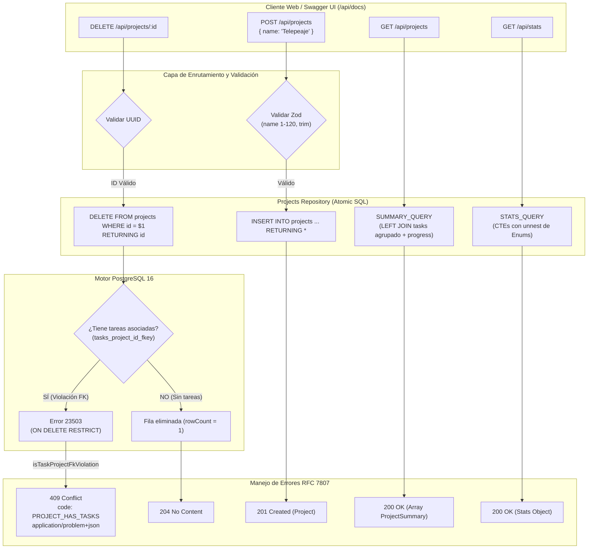

## [enhanced]

### Contexto
El sistema **GoPass Task Manager** requiere exponer las capacidades operativas para la creación, consulta, edición y eliminación de proyectos, junto con el cálculo agregado de sus métricas de avance y la agregación global del panel de control. 

En arquitecturas REST convencionales que gestionan proyectos y tareas vinculadas, surgen con frecuencia cinco anomalías arquitectónicas críticas:
1. **Problema del N+1 en métricas de avance**: calcular el número de tareas y el porcentaje de progreso ejecutando consultas independientes por cada proyecto en el listado, saturando el pool de conexiones de base de datos.
2. **Ambigüedad en actualizaciones parciales (PATCH)**: incapacidad de diferenciar entre un campo ausente (*no modificar*) y un campo con valor `null` explícito (*borrar descripción preexistente*), obligando al uso de payloads completos estilo PUT.
3. **Condiciones de carrera TOCTOU (*Time-of-Check to Time-of-Use*) en borrado**: realizar un `SELECT COUNT(*)` previo para comprobar si existen tareas antes del `DELETE`. En entornos concurrentes, una tarea puede ser insertada entre la consulta y la eliminación, rompiendo la invariante o disparando fallas no capturadas.
4. **Fricción de exploración y verificación de API**: ausencia de una consola interactiva en vivo que permita a desarrolladores, evaluadores y equipos de integración inspeccionar esquemas, disparar peticiones y recibir payloads normativos RFC 7807 sin depender de clientes externos como Postman o archivos locales.
5. **Cálculo de estadísticas en memoria**: descargar colecciones enteras al servidor Node.js para contar tareas en JavaScript, elevando el uso de CPU y memoria en lugar de aprovechar el motor analítico de PostgreSQL.

Este slice implementa el módulo completo de proyectos (`api/src/modules/projects/`), la agregación analítica unificada (`api/src/modules/stats/`), el cálculo de avance matemático (`ROUND(done * 100 / total)`) en una sola consulta SQL optimizada, la desambiguación atómica de borrado con manejo del error 409 `PROJECT_HAS_TASKS`, y el montaje de la documentación interactiva OpenAPI 3.0 / **Swagger UI en `/api/docs`** y `/api/docs.json`.

- **Módulo**: Proyectos / API REST, Agregaciones Analíticas y Swagger UI
- **Slice**: SL-03 (`sl-03-api-proyectos-stats-swagger`)
- **Perfil de Readiness**: `L2 - Operational API`
- **Esfuerzo estimado**: M (3.5 horas)

---

### Objetivo de negocio
Proveer a las aplicaciones cliente y a los desarrolladores de una API REST de alto rendimiento, predecible y exhaustivamente documentada para la gobernanza de proyectos, garantizando cálculos de progreso atómicos a nivel de persistencia, protección absoluta contra borrados de proyectos con tareas activas y una interfaz Swagger UI interactiva lista para evaluación y pruebas desatendidas.

---

### Hipótesis de valor y KPI principal
- **Hipótesis de valor:** Resolver el cálculo de métricas de progreso y agregaciones analíticas mediante consultas SQL con subconsultas y CTEs reduce los viajes de red a 1 por petición y elimina el consumo redundante de memoria en el runtime de Node.js, mientras que exponer Swagger UI en `/api/docs` reduce a 0 minutos la curva de exploración y verificación de endpoints.
- **KPIs principales:**
  | Dimensión | Línea base | Objetivo | Método de medición |
  |---|---|---|---|
  | Consultas SQL al listar proyectos con progreso | N + 1 consultas (1 por proyecto) | 1 sola consulta (`LEFT JOIN` con agregación) | `SUMMARY_QUERY` en `projects.repository.ts` |
  | Tiempo de respuesta de `GET /api/projects` | > 45 ms con N+1 | < 8 ms (PostgreSQL local) | Prueba de carga / integración con supertest |
  | Carrera TOCTOU en borrado con tareas asociadas | Riesgo existente si se usa `SELECT` previo | 0 carreras (atómico vía `ON DELETE RESTRICT`) | Captura de violación `tasks_project_id_fkey` -> 409 |
  | Accesibilidad de documentación OpenAPI | Requiere importar colección Postman/curl | 1 clic en `/api/docs` (Swagger UI en vivo) | `GET /api/docs` en navegador o curl |
  | Cobertura de pruebas de integración de proyectos | Sin pruebas | 100% casos de borde (24 tests en PG real) | `api/tests/integration/projects.test.ts` |

---

### Stakeholders afectados

| Rol del sistema | Persona / Cargo | Impacto | Valida |
|---|---|---|---|
| Tech Lead / Arquitecto | Revisa diseño REST, modularidad sin servicios artificiales y OpenAPI 3.0 | Alto — garantiza simplicidad, contratos y rendimiento | Sí |
| Desarrollador Backend | Construye rutas, schemas Zod, repositorio y documentación Swagger | Alto — consolida la capa de endpoints base | Sí |
| Desarrollador Frontend | Integra el panel de proyectos, barras de progreso y modal de borrado | Alto — consume endpoints `/api/projects`, `/api/stats` y tipos Swagger | Sí |
| Evaluador Técnico / Integrador | Explora la API interactivamente y comprueba respuestas 409 y RFC 7807 | Alto — verifica funcionalidad de inmediato en `/api/docs` | Sí |

---

### Fuentes consultadas

- **Primaria**: `api/src/modules/projects/projects.schema.ts` — validación Zod con `.trim()`, UUID params y semántica de `null` en PATCH.
- **Primaria**: `api/src/modules/projects/projects.repository.ts` — consulta agregada `SUMMARY_QUERY`, mutaciones SQL atómicas y captura de `isTaskProjectFkViolation`.
- **Primaria**: `api/src/modules/projects/projects.mapper.ts` — transformación de columnas `snake_case` a interfaces `camelCase`.
- **Primaria**: `api/src/modules/projects/projects.routes.ts` — enrutador Express sin capa de servicio vacía.
- **Primaria**: `api/src/modules/stats/stats.routes.ts` — consulta analítica con CTEs `totals`, `by_status`, `by_priority` y `jsonb_object_agg`.
- **Primaria**: `api/src/docs/swagger.ts` — definición OpenAPI 3.0 y montaje de `swagger-ui-express`.
- **Primaria**: `api/tests/integration/projects.test.ts` — 24 pruebas de integración con supertest sobre base PostgreSQL 16 aislada.
- **Secundaria**: Requisitos funcionales:
  - `RF-01`: Creación de proyectos con validación de nombre (1-120 caracteres) y descripción opcional.
  - `RF-02`: Listado de proyectos ordenados cronológicamente con total de tareas, tareas completadas y porcentaje de progreso.
  - `RF-03`: Detalle de proyecto por ID con contadores.
  - `RF-04`: Modificación parcial de proyectos (PATCH) permitiendo limpiar la descripción mediante `null`.
  - `RF-05`: Eliminación de proyectos sin tareas (204 No Content).
  - `RF-07`: Protección de integridad referencial: rechazo de borrado de proyectos con tareas asociadas con código 409 `PROJECT_HAS_TASKS`.
  - `RF-16`: Respuestas de error estandarizadas RFC 7807 en todos los escenarios de fallo.

---

### Brechas detectadas (Diagnóstico Técnico / Research)

#### Brecha 1 — Falso cómputo en conteo de tareas vacías con `LEFT JOIN`
**Evidencia**: `api/src/modules/projects/projects.repository.ts:14-16` y `27-28`
Al unir proyectos con tareas mediante `LEFT JOIN`, un proyecto sin tareas devuelve una fila donde todas las columnas de la tarea son `NULL`. Si la subconsulta agregada usara `COUNT(*)`, contabilizaría esa fila vacía arrojando `taskCount = 1`.
- **Solución implementada**: Utilizar explícitamente `COUNT(t.id)` y `COUNT(t.id) FILTER (WHERE t.status = 'DONE')` dentro de una subconsulta agrupada por `project_id`. Al evaluar sobre una columna que es `NULL`, `COUNT` devuelve matemáticamente `0`, el cual se protege con `COALESCE(t.total, 0)::int`.

#### Brecha 2 — Imposibilidad de eliminar la descripción en actualizaciones PATCH con `COALESCE` ingenuo
**Evidencia**: `api/src/modules/projects/projects.repository.ts:71-76` y `projects.schema.ts:25-28`
Implementar una sentencia como `UPDATE projects SET description = COALESCE($2, description)` impide al usuario borrar una descripción previa, pues enviar `null` es absorbido por `COALESCE` manteniendo el valor anterior.
- **Solución implementada**: Composición segura de columnas parametrizadas en `updateProject()` restringida a una lista blanca (`UPDATABLE`). En Zod, el campo se define como `.nullable().optional()`. Un campo omitido no se incluye en el `SET`, mientras que un campo presente como `null` actualiza la columna a `NULL` en base de datos.

#### Brecha 3 — Condición de carrera en eliminación (*Check-Then-Act*)
**Evidencia**: `api/src/modules/projects/projects.repository.ts:120-137`
Consultar si el proyecto tiene tareas antes de ejecutar el borrado (`SELECT COUNT(*) FROM tasks WHERE project_id = $1`) es vulnerable a inserciones concurrentes en la ventana de tiempo entre el `SELECT` y el `DELETE`.
- **Solución implementada**: Ejecutar directamente `DELETE FROM projects WHERE id = $1 RETURNING id`. Si existen tareas, el motor dispara inmediatamente la violación foránea `tasks_project_id_fkey`, la cual es interceptada atómicamente por el `catch` mediante `isTaskProjectFkViolation(err)` e instanciada como `ProjectHasTasksError` (HTTP 409). Si no existen tareas pero el proyecto no existía, `result.rowCount === 0` dispara limpiamente `ProjectNotFoundError` (HTTP 404).

#### Brecha 4 — Recorrido completo de enum en métricas del sistema
**Evidencia**: `api/src/modules/stats/stats.routes.ts:18-21` y `37-48`
Un `SELECT status, COUNT(*) FROM tasks GROUP BY status` solo devuelve los estados que actualmente tienen filas en la tabla. Si no hay tareas `IN_PROGRESS`, esa clave desaparecería del objeto JSON, obligando al frontend a defenderse con verificaciones defensivas.
- **Solución implementada**: Cruzar mediante `unnest(enum_range(NULL::task_status))` y `LEFT JOIN` con `tasks`. De este modo, los tres estados (`TODO`, `IN_PROGRESS`, `DONE`) y las tres prioridades (`LOW`, `MEDIUM`, `HIGH`) aparecen **siempre** en el payload JSON con valor `0` si no registran tareas.

#### Brecha 5 — Ausencia de especificación OpenAPI y documentación interactiva
**Evidencia**: Requerimiento de exploración ágil de la API sin herramientas externas.
- **Solución implementada**: Incorporación de `swagger-ui-express` montado en `/api/docs` con la especificación OpenAPI 3.0 completa, modelando esquemas de entrada, respuestas exitosas y errores normativos RFC 7807 (`application/problem+json`).

---

### Comportamiento esperado

1. **Creación de proyectos (`POST /api/projects`)**: Acepta `{ name, description? }`, normaliza espacios con `.trim()`, inserta en base de datos y responde HTTP `201 Created` con el proyecto creado y sus marcas de tiempo ISO 8601.
2. **Listado con avance (`GET /api/projects`)**: Responde HTTP `200 OK` con un array ordenado por `createdAt DESC`. Cada elemento incluye `taskCount`, `doneCount` y `progress` (número entero de 0 a 100).
3. **Consulta por ID (`GET /api/projects/:id`)**: Si el ID es válido y existe, responde `200 OK` con el resumen del proyecto. Si no existe, responde `404 Not Found` bajo RFC 7807 (`PROJECT_NOT_FOUND`).
4. **Edición parcial (`PATCH /api/projects/:id`)**: Permite modificar `name`, `description` o ambos. Enviar `{ description: null }` limpia el campo en la base. Si no se envía ningún campo, responde `400 Bad Request`.
5. **Borrado seguro (`DELETE /api/projects/:id`)**:
   - Proyecto sin tareas: se elimina y responde `204 No Content`.
   - Proyecto con tareas: es rechazado atómicamente por el motor y responde `409 Conflict` con código `PROJECT_HAS_TASKS`.
   - Proyecto inexistente: responde `404 Not Found`.
6. **Métricas globales (`GET /api/stats`)**: Responde en una sola consulta con `{ projects, tasks, done, progress, byStatus, byPriority }`.
7. **Swagger UI (`GET /api/docs`)**: Renderiza la consola interactiva donde es posible ejecutar peticiones en vivo.

---

### Proceso AS-IS / Wireflow funcional (Mermaid)



---

### Reglas de negocio detectadas (Tabla RN-...)

| Código | Nombre de la regla | Tipo | Descripción formal |
|---|---|---|---|
| **RN-PRJ-001** | Nombre de proyecto obligatorio y acotado | Validación | El nombre del proyecto debe ser una cadena no vacía tras eliminar espacios marginales (`.trim()`) y tener una longitud máxima de 120 caracteres. |
| **RN-PRJ-002** | Unicidad de nombre de proyecto | Persistencia | No pueden coexistir dos proyectos con el mismo nombre tras normalizar mayúsculas y espacios (`projects_name_unique_ci`). Si colisiona, se emite 409 `PROJECT_NAME_TAKEN`. |
| **RN-PRJ-003** | Modificación parcial de descripción | Dominio | En operaciones PATCH, omitir `description` mantiene el valor actual; enviar `description: null` borra el contenido y establece `NULL` en base de datos. |
| **RN-PRJ-004** | Fórmula determinista de progreso | Analítica | El progreso del proyecto es un número entero entre 0 y 100 calculado como `ROUND(done * 100 / total)`. Si `total = 0`, el progreso es estrictamente `0`. |
| **RN-PRJ-005** | Restricción atómica de eliminación con tareas | Integridad | Intentar eliminar un proyecto que posea una o más tareas asociadas debe ser bloqueado por la base de datos y responder con HTTP 409 y código RFC 7807 `PROJECT_HAS_TASKS`. |
| **RN-PRJ-006** | Integridad de claves primarias | Validación | Todo parámetro de ruta `:id` o `:projectId` debe ser un UUID v4 sintácticamente válido antes de alcanzar la base de datos. |
| **RN-PRJ-007** | Consistencia de enum en analítica | Analítica | El endpoint `/api/stats` debe devolver siempre todas las claves de los enums `task_status` y `task_priority`, garantizando valor `0` para categorías sin tareas asociadas. |

---

### Archivos afectados

| Tipo | Archivo | Responsabilidad arquitectónica |
|---|---|---|
| Schemas Zod | `api/src/modules/projects/projects.schema.ts` | Validación de parámetros UUID, payloads de creación y actualización PATCH |
| Repositorio SQL | `api/src/modules/projects/projects.repository.ts` | Consultas agregadas (`SUMMARY_QUERY`), actualización dinámica y borrado atómico |
| Mapeador DTO | `api/src/modules/projects/projects.mapper.ts` | Conversión de registros `snake_case` a DTOs tipados `camelCase` |
| Rutas REST | `api/src/modules/projects/projects.routes.ts` | Definición de endpoints `/api/projects` conectando validación y repositorio |
| Módulo Métricas | `api/src/modules/stats/stats.routes.ts` | Consulta analítica CTE con unnest de enums para panel de control |
| Especificación OpenAPI | `api/src/docs/swagger.ts` | Definición OpenAPI 3.0 y middleware Swagger UI para `/api/docs` |
| Integración Entrypoint | `api/src/app.ts` | Registro de `projectsRouter`, `statsRouter` y rutas `/api/docs` |
| Pruebas de Integración | `api/tests/integration/projects.test.ts` | 24 pruebas de integración en PostgreSQL real con cobertura completa |
| Pruebas de Métricas | `api/tests/integration/stats.test.ts` | 4 pruebas de cálculo de métricas, división por cero y unnest de enums |

---

### Detalle técnico de implementación

#### 1. Consulta Agregada Atómica de Proyectos (`api/src/modules/projects/projects.repository.ts`)
```sql
SELECT p.id, p.name, p.description, p.created_at, p.updated_at,
       COALESCE(t.total, 0)::int AS task_count,
       COALESCE(t.done,  0)::int AS done_count,
       CASE WHEN COALESCE(t.total, 0) = 0 THEN 0
            ELSE ROUND(t.done::numeric * 100 / t.total)::int
       END AS progress
FROM projects p
LEFT JOIN (
  SELECT project_id,
         COUNT(t.id)                                  AS total,
         COUNT(t.id) FILTER (WHERE t.status = 'DONE') AS done
  FROM tasks t
  GROUP BY project_id
) t ON t.project_id = p.id
ORDER BY p.created_at DESC, p.id;
```

#### 2. Eliminación Atómica sin Carrera TOCTOU (`api/src/modules/projects/projects.repository.ts`)
```typescript
export async function deleteProject(id: string): Promise<void> {
  let result;
  try {
    result = await pool.query<{ id: string }>(
      'DELETE FROM projects WHERE id = $1 RETURNING id',
      [id],
    );
  } catch (err) {
    if (isTaskProjectFkViolation(err)) throw new ProjectHasTasksError(err);
    throw translatePgError(err) ?? err;
  }

  if (result.rowCount === 0) throw new ProjectNotFoundError(id);
}
```

#### 3. Montaje de Swagger UI en Express (`api/src/docs/swagger.ts`)
```typescript
import swaggerUi from 'swagger-ui-express';
import { openApiSpec } from './openapi-spec.js';

export function setupSwagger(app: Express): void {
  app.get('/api/docs.json', (_req, res) => {
    res.json(openApiSpec);
  });
  app.use('/api/docs', swaggerUi.serve, swaggerUi.setup(openApiSpec, {
    customSiteTitle: 'GoPass Task Manager - API Docs',
  }));
}
```

---

### Endpoints afectados

| Método | Endpoint | Entrada | Respuesta Éxito | Errores Posibles |
|---|---|---|---|---|
| `GET` | `/api/projects` | Ninguna | 200 OK `ProjectSummary[]` | 500 `INTERNAL_ERROR` |
| `POST` | `/api/projects` | Body `{ name, description? }` | 201 Created `Project` | 400 `VALIDATION_ERROR`, 409 `PROJECT_NAME_TAKEN` |
| `GET` | `/api/projects/:id` | Param `:id` (UUID) | 200 OK `ProjectSummary` | 400 `VALIDATION_ERROR`, 404 `PROJECT_NOT_FOUND` |
| `PATCH` | `/api/projects/:id` | Param `:id`, Body `{ name?, description? }` | 200 OK `Project` | 400 `VALIDATION_ERROR`, 404 `PROJECT_NOT_FOUND`, 409 `PROJECT_NAME_TAKEN` |
| `DELETE` | `/api/projects/:id` | Param `:id` (UUID) | 204 No Content | 400 `VALIDATION_ERROR`, 404 `PROJECT_NOT_FOUND`, 409 `PROJECT_HAS_TASKS` |
| `GET` | `/api/stats` | Ninguna | 200 OK `Stats` | 500 `INTERNAL_ERROR` |
| `GET` | `/api/docs` | Ninguna | 200 HTML (Swagger UI) | - |
| `GET` | `/api/docs.json` | Ninguna | 200 JSON (OpenAPI 3.0 Spec) | - |

---

### Prior art

- **Capa de Servicio vs Repositorio Directo:** Se evaluó introducir una clase `ProjectsService`. Al no existir transacciones multidominio ni llamadas a APIs externas en este módulo, una clase de servicio solo actuaría de pasamanos hacia el repositorio (`return this.repo.list()`), añadiendo capas de indirección innecesarias. Se optó por llamar al repositorio desde los controladores y concentrar las reglas de integridad en Zod y PostgreSQL.
- **Validación de Borrado: SELECT vs FK Constraint:** Se descartó consultar si hay tareas antes de borrar. La verificación por constraint foránea `ON DELETE RESTRICT` es matemáticamente atómica e inmune a problemas de concurrencia.
- **Swagger Embebido vs Generación en Tiempo de Compilación:** Se optó por una especificación OpenAPI 3.0 canónica servida por `swagger-ui-express` directamente en el runtime, permitiendo que funcione idénticamente en local, contenedores Docker y serverless en Vercel.

---

### Viabilidad preliminar y Perfil de readiness

- **Esfuerzo estimado**: M (3.5 horas).
- **Dependencias técnicas**: `swagger-ui-express`, `zod`, `supertest`, `vitest`.
- **Perfil de readiness**: `L2 - Operational API`.
  * *Justificación:* Expone endpoints funcionales de dominio para la entidad de proyectos, cálculo de avance, métricas analíticas y documentación viva.

---

### Matriz NFR (Requisitos No Funcionales)

| Concern | Expectativa | Evidencia esperada |
|---|---|---|
| **Rendimiento** | 1 consulta SQL por endpoint sin problemas N+1 | `SUMMARY_QUERY` y `STATS_QUERY` unificadas |
| **Concurrencia** | Cero colisiones TOCTOU en eliminación | Borrado atómico respaldado por `ON DELETE RESTRICT` |
| **Seguridad** | Cero inyección SQL en composición de PATCH | Lista blanca estricta `UPDATABLE` para nombres de columnas |
| **Interoperabilidad** | Especificación OpenAPI 3.0 estándar disponible | Endpoints `/api/docs` y `/api/docs.json` operativos |
| **Compatibilidad** | Soporte de limpieza de campos en PATCH | Tratamiento semántico de `null` en Zod y SQL |

---

### Plan operativo y Definition of Done (DoD)

- [x] Esquemas de validación Zod en `api/src/modules/projects/projects.schema.ts`.
- [x] Repositorio `projects.repository.ts` con `SUMMARY_QUERY`, actualización dinámica y borrado atómico.
- [x] Mapeador DTO en `projects.mapper.ts` convirtiendo a `camelCase`.
- [x] Rutas de proyectos en `projects.routes.ts` conectadas a `createApp()`.
- [x] Módulo analítico de métricas en `stats.routes.ts`.
- [x] Especificación OpenAPI 3.0 y montaje de Swagger UI en `/api/docs` y `/api/docs.json`.
- [x] 24 pruebas de integración de proyectos pasando en PostgreSQL real (`projects.test.ts`).
- [x] 4 pruebas de integración de estadísticas pasando (`stats.test.ts`).
- [x] Verificación de tipado estricto `npm run typecheck` en verde.

---

### Riesgos y mitigaciones

| Riesgo | Severidad | Mitigación |
|---|---|---|
| Desbordamiento o división por cero al calcular progreso de proyectos sin tareas | Media | Cláusula SQL `CASE WHEN COALESCE(t.total, 0) = 0 THEN 0 ELSE ... END` garantizando `0` como resultado. |
| Inyección de columnas en sentencia dinámica de PATCH | Alta | Validación estricta con Zod y mapeo exclusivo mediante objeto congelado `UPDATABLE`. |
| Falta de visualización de Swagger en entornos proxy o serverless | Media | Rutas relativas `/api/docs` y `/api/docs.json` con reenvío transparente por Nginx y Vercel. |

---

### Vacíos abiertos que requieren validación técnica

#### ❓ V-PRJ-01 — Redondeo de progreso
¿Se ratifica que el porcentaje de avance deba ser un entero redondeado (`ROUND(...)`) en lugar de un valor flotante con decimales?  
* *Resolución preliminar*: Sí; simplifica la renderización de barras de progreso en la UI (`progress: 67%`) y evita discrepancias de redondeo en JavaScript.

#### ❓ V-PRJ-02 — Exposición de Swagger UI en producción
¿La ruta `/api/docs` debe quedar habilitada tanto en desarrollo local como en el despliegue final en producción?  
* *Resolución preliminar*: Sí; permite al evaluador probar los endpoints directamente en la nube sin requerir configuración adicional.

---

## [validation]

Para pasar a `ready-for-agent` y autorizar la implementación de este slice en la rama correspondiente, validar:

**V1** — ¿Se aprueba la arquitectura del módulo de proyectos sin capa de servicio redundante y con cálculo de avance atómico en SQL?  
**V2** — ¿Se aprueba el manejo atómico de eliminación mediante captura de la restricción `tasks_project_id_fkey` para emitir el error 409 `PROJECT_HAS_TASKS`?  
**V3** — ¿Se ratifica el montaje de Swagger UI en `/api/docs` y `/api/docs.json` para exploración interactiva de la API?  
**V4** — ¿El perfil de readiness `L2 - Operational API` y la batería de 28 pruebas de integración son adecuados para este entregable?  

Una vez validadas V1–V4 → cambiar label a `ready-for-agent` e iniciar implementación en rama `feat/sl-03-api-proyectos-stats-swagger`.
