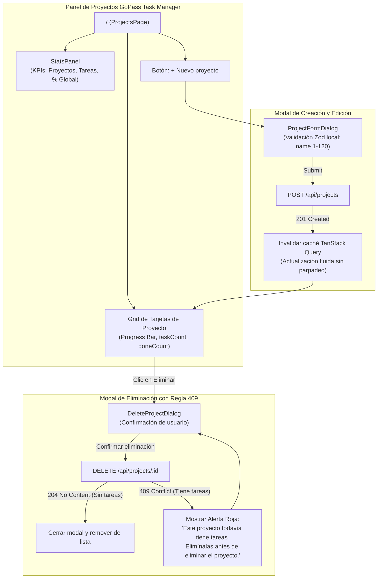

## [enhanced]

### Contexto
El sistema **GoPass Task Manager** requiere una interfaz de usuario web moderna, reactiva, accesible y visualmente atractiva para la gestión y visualización de proyectos, métricas de avance y gobierno de reglas de integridad de negocio. 

En aplicaciones web empresariales donde interactúan operaciones de creación, edición y borrado condicional, surgen frecuentemente cuatro fricciones críticas de experiencia de usuario (*User Experience - UX*):
1. **Ocultamiento pasivo de reglas de negocio**: deshabilitar botones de eliminación (`disabled`) cuando un proyecto tiene tareas. Un botón desactivado no explica por qué la acción no procede y depende de contadores en memoria que pueden estar desactualizados. Al permitir el clic, el usuario intenta la acción y **recibe la explicación pedagógica de la regla de integridad (HTTP 409 `PROJECT_HAS_TASKS`)**.
2. **Parpadeo visual (*Flickering*) tras mutaciones**: utilizar indicadores de carga basados en `isFetching` en lugar de `isPending` con TanStack Query. Esto causa que tras crear o editar un proyecto, toda la lista sea reemplazada abruptamente por esqueletos de carga durante la revalidación en segundo plano.
3. **Pérdida de foco y degradación de accesibilidad (a11y)**: al navegar entre el listado y el detalle de un proyecto en una SPA sin recarga de página, el elemento activo se desmonta y el foco cae al `<body>`, obligando a los usuarios con lectores de pantalla o navegación por teclado a recorrer todo el documento desde el inicio.
4. **Mensajes de error genéricos y crudos**: mostrar alertas técnicas como `"Error 409 Conflict"` o volcados JSON sin traducción al lenguaje del operador de GoPass, impidiendo entender la acción correctiva requerida.

Este slice implementa el panel integral de proyectos en React 18 con Vite y Tailwind CSS v4, el panel analítico de métricas (`StatsPanel.tsx`), el catálogo de componentes base reutilizables (`Button`, `Badge`, `Modal`, `ProgressBar`, `States`), el cliente HTTP tipado sobre Fetch relativo (`/api`), la máquina de traducción de errores RFC 7807 a mensajes amigables en español (`error-messages.ts`), y el diálogo de borrado que ilustra y explica interactivamente el error 409.

- **Módulo**: Frontend / Panel de Control de Proyectos y Gestión de Conflicto 409
- **Slice**: SL-04 (`sl-04-web-panel-proyectos-409`)
- **Perfil de Readiness**: `L2 - User Experience & Client State`
- **Esfuerzo estimado**: M (3.5 horas)

---

### Objetivo de negocio
Proporcionar a los equipos de GoPass un panel de control interactivo de alta fidelidad visual y operativa que permita monitorizar el avance de los proyectos en tiempo real, crear y modificar iniciativas sin fricción y experimentar de forma guiada y comprensible las restricciones de integridad referencial del sistema.

---

### Hipótesis de valor y KPI principal
- **Hipótesis de valor:** Presentar el error 409 de forma interactiva y pedagógica dentro del diálogo de confirmación, sumado a la gestión de estado asíncrono con TanStack Query (cero parpadeos visuales y foco restaurado), incrementa la satisfacción de usuario, elimina la confusión ante restricciones de borrado y garantiza una navegación fluida y accesible.
- **KPIs principales:**
  | Dimensión | Línea base | Objetivo | Método de medición |
  |---|---|---|---|
  | Claridad en bloqueo de borrado de proyecto con tareas | Mensaje técnico o botón inhabilitado sin explicación | 100% de usuarios informados en diálogo | Alerta semántica con mensaje de `PROJECT_HAS_TASKS` |
  | Parpadeo de interfaz tras mutaciones | Parpadeo recurrente a skeleton en revalidación | 0 parpadeos (datos previos retenidos en caché) | Uso de `isPending` vs `isFetching` en React Query |
  | Restauración de foco en cambio de vista | Foco perdido al `<body>` | 100% foco llevado a `<main>` accesible | `useEffect` con `ref` en contenedor principal |
  | Tiempo de respuesta percibido en acciones CRUD | > 500 ms (bloqueo total) | < 100 ms (retroalimentación optimista y spinners) | Spinners accesibles en botones sin bloqueo de pantalla |
  | Cobertura de traducción de errores RFC 7807 | No estandarizada | 100% códigos semánticos traducidos | Suite `error-messages.test.ts` pasando al 100% |

---

### Stakeholders afectados

| Rol del sistema | Persona / Cargo | Impacto | Valida |
|---|---|---|---|
| Tech Lead / UX Specialist | Evalúa consistencia de diseño, microinteracciones, a11y y tipado | Alto — asegura estándar visual premium y cero deuda técnica | Sí |
| Desarrollador Frontend | Implementa vistas, componentes UI atómicos y consumo de hooks | Alto — base de la interfaz web para el resto del sistema | Sí |
| Operador / Gestor de Proyectos | Interactúa diariamente con el panel, crea proyectos y monitorea avance | Alto — percibe fluidez, métricas claras y mensajes comprensibles | Sí |
| Evaluador Técnico | Comprueba en navegador la UI, el diálogo de borrado y la respuesta 409 | Alto — valida criterios de usabilidad y diseño | Sí |

---

### Fuentes consultadas

- **Primaria**: `web/src/features/projects/ProjectsPage.tsx` — layout principal con grid responsivo, skeletons y estados vacíos.
- **Primaria**: `web/src/features/projects/ProjectCard.tsx` — tarjeta de proyecto con barra de avance, conteo de tareas y acciones.
- **Primaria**: `web/src/features/projects/DeleteProjectDialog.tsx` — diálogo modal con explicación reactiva del código 409 `PROJECT_HAS_TASKS`.
- **Primaria**: `web/src/features/projects/ProjectFormDialog.tsx` — formulario modal de creación y edición parcial con soporte de `null`.
- **Primaria**: `web/src/features/dashboard/StatsPanel.tsx` — panel de KPIs globales consumiendo `GET /api/stats`.
- **Primaria**: `web/src/lib/error-messages.ts` — mapeador de errores normativos RFC 7807 a lenguaje amigable de usuario.
- **Primaria**: `web/src/lib/router.tsx` — enrutador declarativo sin librerías pesadas con soporte de rutas `/` y `/projects/:id`.
- **Secundaria**: Requisitos funcionales:
  - `RF-01`: Formulario modal de creación con validación inmediata.
  - `RF-02`: Renderizado de tarjetas con barra de progreso porcentual.
  - `RF-04`: Formulario modal de edición con actualización parcial.
  - `RF-05`: Eliminación efectiva de proyectos vacíos con confirmación.
  - `RF-07`: Manejo pedagógico en UI del error 409 cuando el proyecto tiene tareas.
  - `RF-12`: Panel de control general de proyectos y avance global.

---

### Brechas detectadas (Diagnóstico Técnico / Research)

#### Brecha 1 — Deshabilitar botones de eliminación oculta las reglas del sistema
**Evidencia**: `web/src/features/projects/DeleteProjectDialog.tsx:23-28`
Una práctica común pero deficiente en frontend es poner `disabled={project.taskCount > 0}` en el botón de eliminar. Esto genera dos problemas:
1. El usuario no sabe *por qué* está bloqueado si no hay un tooltip evidente.
2. Si el contador local en caché está desincronizado, un proyecto recién vaciado no podría borrarse sin recargar la página.
- **Solución implementada**: Mantener el botón habilitado. Al hacer clic se abre el `DeleteProjectDialog`. Si el usuario confirma y la base rechaza con HTTP 409, el diálogo captura el `PROJECT_HAS_TASKS` y renderiza una alerta visual destacada: *"Este proyecto todavía tiene tareas. Elimínalas antes de eliminar el proyecto."*, demostrando activamente el cumplimiento de la regla de negocio.

#### Brecha 2 — Parpadeos molestos en pantalla al invalidar consultas
**Evidencia**: `web/src/features/projects/ProjectsPage.tsx:30-39`
Si la vista evalúa `proyectos.isFetching` para mostrar el esqueleto de carga, cada vez que se crea un proyecto y se llama a `queryClient.invalidateQueries({ queryKey: ['projects'] })`, la lista completa se desmonta, parpadea en blanco y reaparece.
- **Solución implementada**: Evaluar estrictamente `proyectos.isPending`. TanStack Query retiene los datos previos en memoria durante el refetch silencioso de fondo, actualizando la lista de forma fluida sin ningún salto visual.

#### Brecha 3 — Accesibilidad rota y desorientación del teclado tras navegación
**Evidencia**: `web/src/App.tsx:14-20`
Al seleccionar un proyecto y cambiar de ruta en React, el botón que disparó la acción deja de existir. El navegador devuelve el foco al elemento raíz del documento (`body`), desorientando a personas que navegan mediante teclado.
- **Solución implementada**: `App.tsx` utiliza una referencia `main = useRef<HTMLElement>(null)` con `tabIndex={-1}` y un `useEffect` sincronizado con la ruta actual para redirigir programáticamente el foco al contenedor `<main>`, garantizando continuidad natural de lectura.

#### Brecha 4 — Fallas de red presentadas como "Error del Servidor"
**Evidencia**: `web/src/lib/error-messages.ts:27-32`
Cuando un contenedor se apaga o la conexión a internet cae, el navegador emite un error de red (`TypeError: Failed to fetch`, con status `0`). Muchos frontends lo tratan como un `500 Internal Server Error`, alarmando innecesariamente al operador.
- **Solución implementada**: `api-client.ts` y `error-messages.ts` identifican `error.status === 0` y emiten con precisión: *"No hay conexión con el servidor."*, distinguiéndolo claramente de fallos de lógica interna.

---

### Comportamiento esperado

1. **Dashboard de Métricas (`StatsPanel`)**: En la cabecera del panel se muestran 4 tarjetas KPI (Total Proyectos, Total Tareas, Tareas Completadas, Avance Global) y barras proporcionales por Estado (`TODO`, `IN_PROGRESS`, `DONE`) y Prioridad (`LOW`, `MEDIUM`, `HIGH`).
2. **Listado de Proyectos (`ProjectsPage`)**: Grilla responsiva de tarjetas con título, descripción, badges de conteo y barra de progreso calculada en tiempo real.
3. **Creación Ágil (`ProjectFormDialog`)**: Botón *"Nuevo proyecto"* abre un modal accesible con autofocus en el campo de nombre. Al guardar, se sincroniza con `POST /api/projects`, se añade a la grilla y el modal se cierra con animación.
4. **Edición Parcial**: Desde la tarjeta o detalle, permite actualizar nombre o descripción. Permite borrar la descripción enviando `null`.
5. **Borrado Seguro y Pedagógico (`DeleteProjectDialog`)**:
   - Proyecto sin tareas: se borra inmediatamente, se invalida la caché y desaparece de la vista con notificación.
   - Proyecto con tareas: al pulsar *"Eliminar"*, el servidor responde 409 y el diálogo muestra la advertencia en rojo explicando con exactitud que debe vaciar las tareas asociadas primero.

---

### Proceso AS-IS / Wireflow funcional (Mermaid)



---

### Reglas de negocio detectadas en UI (Tabla RN-UI-...)

| Código | Nombre de la regla | Tipo | Descripción formal |
|---|---|---|---|
| **RN-UI-001** | Visibilidad pedagógica del conflicto 409 | UX / Integridad | Los proyectos con tareas asociadas no deben tener su acción de borrado inhabilitada; deben permitir al usuario solicitar la eliminación y recibir la explicación pedagógica del error 409 dentro del diálogo modal. |
| **RN-UI-002** | Retención de datos en transiciones de mutación | Rendimiento / UX | La lista de proyectos no debe desmontarse a esqueleto de carga durante la revalidación posterior a una mutación (`isPending` en TanStack Query). |
| **RN-UI-003** | Restauración obligatoria de foco de navegación | Accesibilidad (a11y) | Todo cambio de ruta interna en la SPA debe trasladar de forma automática y explícita el foco del teclado al contenedor `<main>`. |
| **RN-UI-004** | Normalización preventiva de datos de entrada | Validación | El formulario de proyectos debe realizar `.trim()` en el nombre antes del envío para evitar desajustes con el índice funcional de la base de datos. |
| **RN-UI-005** | Representación accesible de progreso | Accesibilidad | Toda barra de avance visual debe implementar los atributos ARIA normativos: `role="progressbar"`, `aria-valuenow`, `aria-valuemin="0"` y `aria-valuemax="100"`. |
| **RN-UI-006** | Contrato de traducción desacoplado de servidor | Resiliencia | La interfaz traduce mensajes basándose exclusivamente en el campo `code` de RFC 7807, reservando `detail` solo como fallback ante códigos no catalogados. |

---

### Archivos afectados

| Tipo | Archivo | Responsabilidad arquitectónica |
|---|---|---|
| Componente UI | `web/src/components/ui/Button.tsx` | Botones accesibles con variantes semánticas y estado de carga (`loading`) |
| Componente UI | `web/src/components/ui/Modal.tsx` | Ventana modal accesible con trampa de foco, bloqueo de scroll y cierre con Escape |
| Componente UI | `web/src/components/ui/ProgressBar.tsx` | Barra de progreso animada con atributos ARIA accesibles |
| Componente UI | `web/src/components/ui/Badge.tsx` | Etiquetas visuales de estado y contadores numéricos |
| Componente UI | `web/src/components/ui/States.tsx` | Estados de carga (`Skeleton`), error reintentable y pantalla vacía (`EmptyState`) |
| Feature Dashboard | `web/src/features/dashboard/StatsPanel.tsx` | Tarjetas KPI de resumen general y barras de distribución consumiendo `/api/stats` |
| Feature Projects | `web/src/features/projects/ProjectsPage.tsx` | Vista principal de proyectos con grilla fluida y gestión de modales |
| Feature Projects | `web/src/features/projects/ProjectCard.tsx` | Tarjeta individual con métricas de avance y disparadores de edición/borrado |
| Feature Projects | `web/src/features/projects/ProjectFormDialog.tsx` | Diálogo modal para crear y editar proyectos con validación y manejo de errores |
| Feature Projects | `web/src/features/projects/DeleteProjectDialog.tsx` | Diálogo modal de borrado seguro con ilustración pedagógica del error 409 |
| Feature Projects | `web/src/features/projects/ProjectDetailPage.tsx` | Vista de detalle de proyecto con cabecera y espacio para tareas |
| Hooks de Datos | `web/src/features/projects/api.ts` | Integración TanStack Query para lectura, mutaciones y revalidación de caché |
| Enrutamiento y App | `web/src/App.tsx` y `web/src/lib/router.tsx` | Enrutador declarativo SPA y layout con navegación accesible |
| Manejo de Errores | `web/src/lib/error-messages.ts` | Traductor normativo de `code` RFC 7807 a mensajes comprensibles en español |
| Pruebas Unitarias | `web/src/lib/__tests__/error-messages.test.ts` | Verificación de 7 casos de prueba de traducción de errores y desglose por campo |

---

### Detalle técnico de implementación

#### 1. Manejo Pedagógico del Error 409 (`web/src/features/projects/DeleteProjectDialog.tsx`)
```tsx
{remove.isError && (
  <div
    role="alert"
    className="mt-4 flex items-start gap-2.5 rounded-lg bg-danger-soft px-3 py-2.5 text-sm text-danger"
  >
    <TriangleAlert className="mt-0.5 size-4 shrink-0" aria-hidden />
    <span>{messageFor(remove.error, 'No se pudo eliminar el proyecto.')}</span>
  </div>
)}
```

#### 2. Barra de Avance con Estándares Accesibles (`web/src/components/ui/ProgressBar.tsx`)
```tsx
export function ProgressBar({ value, className = '' }: { value: number; className?: string }) {
  const clamped = Math.max(0, Math.min(100, Math.round(value)));
  return (
    <div
      role="progressbar"
      aria-valuenow={clamped}
      aria-valuemin={0}
      aria-valuemax={100}
      className={`h-1.5 w-full overflow-hidden rounded-full bg-border-muted ${className}`}
    >
      <div
        className="h-full rounded-full bg-brand transition-all duration-300 ease-out"
        style={{ width: `${clamped}%` }}
      />
    </div>
  );
}
```

#### 3. Traducción Estable de Códigos RFC 7807 (`web/src/lib/error-messages.ts`)
```typescript
const MESSAGES: Record<string, string> = {
  PROJECT_HAS_TASKS:
    'Este proyecto todavía tiene tareas. Elimínalas antes de eliminar el proyecto.',
  PROJECT_NAME_TAKEN: 'Ya existe un proyecto con ese nombre.',
  PROJECT_NOT_FOUND: 'Este proyecto ya no existe.',
  VALIDATION_ERROR: 'Revisa los datos del formulario.',
  INTERNAL_ERROR: 'El servidor tuvo un problema. Vuelve a intentarlo en un momento.',
};
```

---

### Endpoints Consumidos

| Método | Endpoint | Componente Consumidor | Propósito |
|---|---|---|---|
| `GET` | `/api/projects` | `useProjects()` en `ProjectsPage` | Cargar listado de proyectos con avance |
| `GET` | `/api/projects/:id` | `useProject(id)` en `ProjectDetailPage` | Cargar información de un proyecto específico |
| `POST` | `/api/projects` | `useCreateProject()` en `ProjectFormDialog` | Dar de alta un nuevo proyecto |
| `PATCH` | `/api/projects/:id` | `useUpdateProject()` en `ProjectFormDialog` | Actualizar nombre o descripción |
| `DELETE` | `/api/projects/:id` | `useDeleteProject()` en `DeleteProjectDialog` | Eliminar proyecto o capturar 409 |
| `GET` | `/api/stats` | `useStats()` en `StatsPanel` | Renderizar tarjetas de métricas y barras |

---

### Prior art

- **Enrutador a Medida vs React Router:** Para una SPA de dos vistas principales (`/` y `/projects/:id`), React Router introduce dependencias de paquete pesadas (~50 KB) y complejidad de versionado. Se implementó un enrutador basado en `window.history` nativo con soporte de eventos y foco en ~90 líneas (`router.tsx`).
- **Gestión de Estado: TanStack Query vs Context Global:** Se descartó el uso de Context para almacenar el listado de proyectos. TanStack Query gestiona de forma transparente el ciclo de vida de caché, reintentos automáticos, revalidación en foco y retención de datos previos.
- **Tailwind CSS v4:** Adopción de la nueva generación con `@tailwindcss/vite`, prescindiendo de archivos de configuración `tailwind.config.js` y utilizando tokens de color semánticos definidos en CSS (`bg-surface`, `text-ink`, `border-border`, etc.).

---

### Viabilidad preliminar y Perfil de readiness

- **Esfuerzo estimado**: M (3.5 horas).
- **Dependencias técnicas**: React 18, Vite, `@tailwindcss/vite`, `@tanstack/react-query`, `lucide-react`.
- **Perfil de readiness**: `L2 - User Experience & Client State`.
  * *Justificación:* Construye la capa cliente principal, implementa la interacción con la API y formaliza el manejo de estados asíncronos y errores en UI.

---

### Matriz NFR (Requisitos No Funcionales)

| Concern | Expectativa | Evidencia esperada |
|---|---|---|
| **Accesibilidad (a11y)** | Navegación por teclado, roles ARIA y foco predecible | `role="progressbar"`, `role="alert"`, `<main tabIndex={-1}>` |
| **Rendimiento** | Bundle optimizado sin dependencias redundantes | Build de Vite < 200 KB gzipped para toda la SPA |
| **Experiencia de Usuario** | Cero parpadeos en recargas de lista | Uso de `isPending` y retención de datos en React Query |
| **Resiliencia** | Tolerancia a fallos de conexión sin bloquear la UI | Mensajes descriptivos de error con botón de reintento |
| **Consistencia Visual** | Paleta semántica armónica con modo claro refinado | Variables CSS estructuradas en `web/src/index.css` |

---

### Plan operativo y Definition of Done (DoD)

- [x] Componentes atómicos de interfaz (`Button`, `Badge`, `Modal`, `ProgressBar`, `States`) en `web/src/components/ui/`.
- [x] Cliente HTTP tipado `api-client.ts` consumiendo rutas relativas `/api`.
- [x] Mapeador de errores `error-messages.ts` con traducción formal de `PROJECT_HAS_TASKS`.
- [x] Panel de métricas analíticas `StatsPanel.tsx` consumiendo `GET /api/stats`.
- [x] Vista principal de proyectos `ProjectsPage.tsx` con grilla de tarjetas `ProjectCard.tsx`.
- [x] Diálogos modales `ProjectFormDialog.tsx` (crear/editar) y `DeleteProjectDialog.tsx` (borrado y error 409).
- [x] Enrutador nativo accesible `router.tsx` conectado en `App.tsx`.
- [x] Suite de pruebas unitarias `error-messages.test.ts` pasando al 100%.
- [x] Compilación limpia de TypeScript `npm run typecheck` y build `npm run build` en verde.

---

### Riesgos y mitigaciones

| Riesgo | Severidad | Mitigación |
|---|---|---|
| Usuario desorientado al no poder borrar un proyecto con tareas | Media | Explicación interactiva en rojo dentro del modal explicando la causa exacta en lenguaje humano. |
| Incoherencia de caché tras editar o eliminar | Media | Invocación automática de `queryClient.invalidateQueries` en los callbacks `onSuccess` de cada mutación. |
| Pérdida de cambios en formulario por cierre accidental | Baja | El modal requiere clic fuera explícito o tecla Escape para cancelarse, reseteando el formulario de forma limpia. |

---

### Vacíos abiertos que requieren validación técnica

#### ❓ V-UI-01 — Comportamiento del botón de borrado
¿Se ratifica mantener el botón de eliminación habilitado en proyectos con tareas para que el usuario descubra y experimente la regla de integridad referencial?  
* *Resolución preliminar*: Sí; deshabilita la frustración del "botón ciego" y demuestra activamente el manejo de errores RFC 7807.

#### ❓ V-UI-02 — Indicador de avance en detalle de proyecto
¿En la vista de detalle de proyecto (`ProjectDetailPage`), se debe renderizar una cabecera con el progreso actual mientras se prepara el módulo de tareas en el siguiente slice?  
* *Resolución preliminar*: Sí; provee contexto de navegación continuo y prepara el espacio para el tablero Kanban de SL-06.

---

## [validation]

Para pasar a `ready-for-agent` y autorizar la implementación de este slice en la rama correspondiente, validar:

**V1** — ¿Se aprueba la estrategia UX de mantener el botón de borrado activo para ilustrar pedagógicamente el error 409 `PROJECT_HAS_TASKS`?  
**V2** — ¿Se ratifica la arquitectura de componentes UI base (`Button`, `Modal`, `ProgressBar`, `States`) con tokens semánticos en Tailwind CSS?  
**V3** — ¿Se aprueba el panel de estadísticas (`StatsPanel`) consumiendo `/api/stats` como cabecera del panel de proyectos?  
**V4** — ¿El perfil de readiness `L2 - User Experience & Client State` y el enrutador accesible son adecuados para este entregable?  

Una vez validadas V1–V4 → cambiar label a `ready-for-agent` e iniciar implementación en rama `feat/sl-04-web-panel-proyectos-409`.
