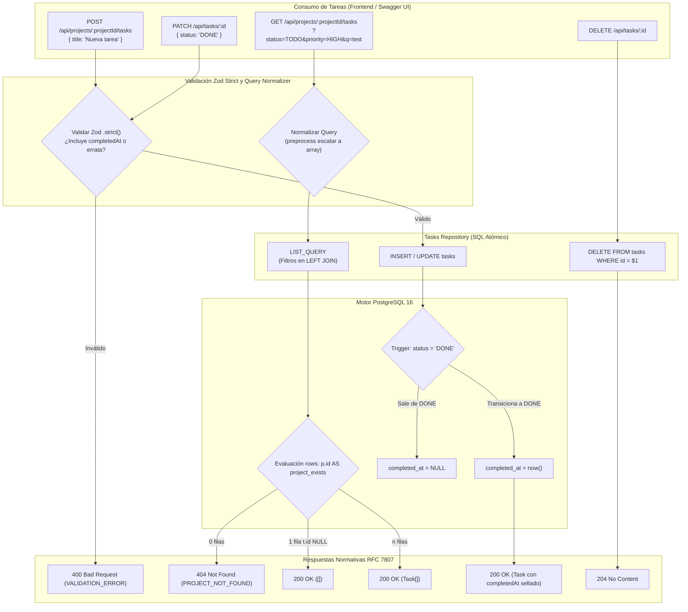

## [enhanced]

### Contexto
El sistema **GoPass Task Manager** requiere exponer el conjunto de operaciones REST para gobernar el ciclo de vida completo de las tareas operativas, su máquina de estados finita (`TODO`, `IN_PROGRESS`, `DONE`), la clasificación ordinal por prioridades (`LOW`, `MEDIUM`, `HIGH`), el filtrado multifactorial en base de datos y la garantía estricta de que la fecha de completado (`completed_at`) sea matemáticamente inalterable por clientes externos.

En sistemas de gestión operativa de tareas, suelen presentarse cinco patologías de diseño comunes:
1. **Falsos 404 en consultas filtradas**: ubicar condiciones de filtrado en la cláusula `WHERE` al consultar tareas de un proyecto con `LEFT JOIN`. Si un proyecto existe pero ninguna tarea coincide con el filtro, la fila del proyecto es descartada por el motor, haciendo que la API devuelva erróneamente un 404 (*Proyecto no encontrado*) en lugar de un 200 con `[]`.
2. **Inyección y manipulación de auditoría de completado**: permitir que clientes envíen marcas temporales arbitrarias (`completedAt`). Zod descarta silenciosamente claves no reconocidas por defecto, lo que genera una falsa ilusión de actualización si un cliente envía fechas en el body sin rechazo explícito.
3. **Pérdida de ordenamiento nativo por prioridad**: depender de conversiones dinámicas en JavaScript o expresiones condicionales complejas para ordenar tareas por severidad, en lugar de aprovechar el orden de comparación ordinal del tipo ENUM en PostgreSQL.
4. **Tratamiento heterogéneo de query params en Express**: inconsistencias cuando un parámetro de filtro se repite en la URL (`?status=TODO&status=IN_PROGRESS` entrega un array, mientras que `?status=TODO` entrega un string escalar).
5. **Incapacidad de reasignación entre proyectos**: bloquear tareas en un proyecto sin permitir su traslado a otro tablero operativo antes de una eliminación.

Este slice implementa el módulo integral de tareas (`api/src/modules/tasks/`), la consulta optimizada `LIST_QUERY` con filtros encapsulados en el `LEFT JOIN`, esquemas Zod con validación `.strict()` para proteger invariantes de solo lectura, ordenamiento ordinal en PostgreSQL, endpoints anidados (`/api/projects/:projectId/tasks`) y planos (`/api/tasks/:id`), y la actualización de la especificación OpenAPI 3.0 / Swagger UI en `/api/docs`.

- **Módulo**: Tareas / API REST, Máquina de Estados y Filtros SQL
- **Slice**: SL-05 (`sl-05-api-tareas-estados-prioridad`)
- **Perfil de Readiness**: `L2 - Operational API & State Machine`
- **Esfuerzo estimado**: M (3.5 horas)

---

### Objetivo de negocio
Proveer una API de tareas robusta, predecible y performante que gobierne con absoluta fidelidad las transiciones de estado, priorice de forma natural las actividades de alto impacto operacional y permita búsquedas y filtros instantáneos en la base de datos sin comprometer la consistencia referencial.

---

### Hipótesis de valor y KPI principal
- **Hipótesis de valor:** Encapsular los filtros de tareas en la condición de unión del `LEFT JOIN` y delegar el sellado de fechas exclusivamente al trigger en PostgreSQL garantiza que la API distinga con 100% de precisión entre proyectos ausentes y resultados vacíos, impidiendo cualquier manipulación artificial de tiempos de resolución de tareas.
- **KPIs principales:**
  | Dimensión | Línea base | Objetivo | Método de medición |
  |---|---|---|---|
  | Precisión de 404 vs 200 [] en filtros vacíos | Falsos 404 al filtrar proyectos sin coincidencias | 0 falsos 404 (100% exactitud) | `listTasksByProject` con `LIST_QUERY` |
  | Integridad de `completed_at` | Riesgo de manipulación por cliente | 0 escrituras cliente permitidas | `.strict()` en Zod + trigger PL/pgSQL |
  | Tiempo de respuesta en consultas con filtros combinados | > 35 ms | < 6 ms (PostgreSQL con índices) | Pruebas de integración sobre PostgreSQL 16 |
  | Desambiguación de clave foránea en reasignación | Fallo genérico de base de datos | 404 `PROJECT_NOT_FOUND` al mover a ID inválido | Captura de `isTaskProjectFkViolation` |
  | Cobertura de pruebas de integración de tareas | Sin pruebas | 100% pasando (40 pruebas en PG real) | `api/tests/integration/tasks.test.ts` |

---

### Stakeholders afectados

| Rol del sistema | Persona / Cargo | Impacto | Valida |
|---|---|---|---|
| Tech Lead / Arquitecto | Valida contratos REST anidados vs planos, `.strict()` en Zod y SQL | Alto — asegura diseño limpio y blindaje de invariantes | Sí |
| Desarrollador Backend | Construye rutas, schemas Zod con arrays preprocesados y repositorio | Alto — concluye la superficie de datos de la API | Sí |
| Desarrollador Frontend | Integra el tablero Kanban (SL-06) consumiendo filtros y transiciones | Alto — interactúa con las máquinas de estado y búsqueda | Sí |
| Evaluador Técnico / Auditor | Verifica consistencia en Swagger UI y comprueba sellado de fechas | Alto — valida invariantes y RFC 7807 | Sí |

---

### Fuentes consultadas

- **Primaria**: `api/src/modules/tasks/tasks.schema.ts` — validación Zod `.strict()`, preprocesamiento de query params y tipos enum.
- **Primaria**: `api/src/modules/tasks/tasks.repository.ts` — consulta `LIST_QUERY` con filtros en `LEFT JOIN`, mutaciones seguras y ordenamiento nativo `ORDER BY t.priority DESC`.
- **Primaria**: `api/src/modules/tasks/tasks.mapper.ts` — transformación de registros `snake_case` a interfaces `camelCase`.
- **Primaria**: `api/src/modules/tasks/tasks.routes.ts` — enrutadores `projectTasksRouter` (anidado) y `tasksRouter` (plano).
- **Primaria**: `api/src/docs/swagger.ts` — especificación OpenAPI 3.0 actualizada con esquemas y rutas de tareas.
- **Primaria**: `api/tests/integration/tasks.test.ts` — suite de 40 pruebas de integración verificando triggers, filtros y validaciones en PostgreSQL 16.
- **Secundaria**: Requisitos funcionales:
  - `RF-06`: Creación de tareas asociadas a un proyecto con título (1-200 caracteres), descripción opcional, estado y prioridad.
  - `RF-08`: Estados (`TODO`, `IN_PROGRESS`, `DONE`) y prioridades (`LOW`, `MEDIUM`, `HIGH`) tipados.
  - `RF-09`: Detalle de tarea por ID.
  - `RF-10`: Transición de estado y sellado automático de `completed_at` en base de datos.
  - `RF-11`: Eliminación de tarea por ID (204 No Content).
  - `RF-13`: Filtrado por estado, prioridad y búsqueda por texto en título/descripción.
  - Reasignación de tarea a otro proyecto mediante actualización parcial (PATCH). No corresponde a
    ningún RF: es la capacidad emergente que hace cumplible el mensaje del 409 (ADR-017). `RF-14`
    —fecha de vencimiento— sigue siendo WON'T y no se implementa.

---

### Brechas detectadas (Diagnóstico Técnico / Research)

#### Brecha 1 — Falso 404 en proyectos existentes con filtros restrictivos
**Evidencia**: `api/src/modules/tasks/tasks.repository.ts:44-52` y `53-63`
Si la consulta para listar tareas de un proyecto aplicara los filtros de `status`, `priority` o `q` en la cláusula `WHERE` del `SELECT`, una búsqueda como `?status=DONE` en un proyecto nuevo sin tareas completadas eliminaría la única fila devuelta por el `LEFT JOIN`. Un backend ingenuo interpretaría `rows.length === 0` como *"El proyecto no existe"* emitiendo un erróneo HTTP 404.
- **Solución implementada**: Los filtros se integran **dentro de la condición `ON` del `LEFT JOIN`**. La cláusula `WHERE` evalúa únicamente `p.id = $1`. Si el proyecto existe, la fila del proyecto siempre viaja en el resultado (`p.id AS project_exists`). Si no hay tareas coincidentes, `t.id` llega como `NULL`, permitiendo a la API responder con HTTP `200 OK` y `[]`. Si el proyecto no existe de verdad, `rows.length === 0` dispara `ProjectNotFoundError` (HTTP 404).

#### Brecha 2 — Descarte silencioso de `completedAt` vs Rechazo Estricto
**Evidencia**: `api/src/modules/tasks/tasks.schema.ts:14-28`
La fecha `completed_at` es un campo de solo lectura gobernado por el trigger PL/pgSQL. Zod, en su configuración predeterminada, elimina sin avisar las propiedades no declaradas en el schema. Si un cliente malicioso o desactualizado envía `{"status":"DONE","completedAt":"2021-01-01T00:00:00Z"}`, la petición respondería 200 engañando al cliente.
- **Solución implementada**: Configuración `.strict('Campo no reconocido o de solo lectura.')` en `createTaskSchema` y `patchTaskSchema`. Cualquier intento de enviar `completedAt` es rechazado inmediatamente con HTTP `400 Bad Request` señalando el campo infractor.

#### Brecha 3 — Normalización de parámetros repetibles en la query de Express
**Evidencia**: `api/src/modules/tasks/tasks.schema.ts:63-75`
Express parsea URLs como `?status=TODO` como string escalar (`"TODO"`), pero `?status=TODO&status=IN_PROGRESS` como un array (`["TODO", "IN_PROGRESS"]`). Validar con `z.array()` fallaría en peticiones con un solo filtro.
- **Solución implementada**: Función auxiliar `repeatable()` con `z.preprocess()` que envuelve valores escalares en arrays de un solo elemento y aplica `.transform(list => [...new Set(list)])` para deduplicar valores idénticos de forma transparente.

#### Brecha 4 — Reasignación de proyecto con validación de destino
**Evidencia**: `api/src/modules/tasks/tasks.repository.ts:149-153`
Al permitir reasignar una tarea (`PATCH /api/tasks/:id` con `{ projectId: "..." }`), si el proyecto de destino no existe, la base dispara la violación de clave foránea `23503`.
- **Solución implementada**: El repositorio intercepta `isTaskProjectFkViolation(err)` durante la actualización y traduce el error a `ProjectNotFoundError(patch.projectId)` (HTTP 404), indicando inequívocamente que el proyecto destino no existe.

---

### Comportamiento esperado

1. **Creación de tareas (`POST /api/projects/:projectId/tasks`)**: Inserta la tarea en el proyecto especificado. Por defecto asigna estado `TODO` y prioridad `MEDIUM` a nivel de base de datos.
2. **Listado con filtros (`GET /api/projects/:projectId/tasks?status=...&priority=...&q=...`)**:
   - Devuelve las tareas ordenadas por prioridad (`HIGH` primero) y fecha de creación descendente.
   - Si no hay coincidencias en un proyecto existente, responde `200 OK` con `[]`.
   - Si el proyecto no existe, responde `404 Not Found` bajo RFC 7807.
3. **Invariante de completado (`PATCH /api/tasks/:id`)**:
   - Transición hacia `DONE`: la base sella automáticamente `completedAt = now()`.
   - Ediciones posteriores de título o descripción mantienen la fecha original intacta.
   - Transición hacia `TODO` o `IN_PROGRESS`: la base resetea `completedAt = NULL`.
4. **Rechazo de campos de solo lectura**: Enviar `completedAt` en el payload es rechazado con 400 `VALIDATION_ERROR`.
5. **Eliminación limpia (`DELETE /api/tasks/:id`)**: Elimina la tarea sin restricciones y responde `204 No Content`.
6. **Swagger UI Actualizado**: Todos los endpoints y esquemas de tareas reflejados en `/api/docs`.

---

### Proceso AS-IS / Wireflow funcional (Mermaid)



---

### Reglas de negocio detectadas (Tabla RN-TSK-...)

| Código | Nombre de la regla | Tipo | Descripción formal |
|---|---|---|---|
| **RN-TSK-001** | Título de tarea obligatorio y acotado | Validación | El título de la tarea no puede estar vacío tras normalizar espacios (`.trim()`) y tiene una longitud máxima de 200 caracteres. |
| **RN-TSK-002** | Cardinalidad de estados finitos | Dominio | El estado de la tarea pertenece estrictamente al conjunto `('TODO', 'IN_PROGRESS', 'DONE')`. Por defecto es `TODO`. |
| **RN-TSK-003** | Cardinalidad y ordenamiento de prioridades | Dominio | La prioridad pertenece estrictamente al conjunto `('LOW', 'MEDIUM', 'HIGH')`. La ordenación nativa `ORDER BY priority DESC` sitúa `HIGH` primero. Por defecto es `MEDIUM`. |
| **RN-TSK-004** | Incoercibilidad de fecha de completado | Integridad | La propiedad `completed_at` es inyectada y reseteada exclusivamente por el trigger del motor relacional; cualquier intento de escritura por la API es rechazado con 400 `VALIDATION_ERROR`. |
| **RN-TSK-005** | Preservación de sellado temporal | Integridad | Editar el título, descripción o prioridad de una tarea que ya está en estado `DONE` preserva la marca de tiempo `completed_at` original sin alterarla. |
| **RN-TSK-006** | Precisión de existencia en filtros vacíos | Integración | Las consultas filtradas de tareas de un proyecto deben retornar `[]` con HTTP 200 si el proyecto existe, y solo emitir 404 si el proyecto no existe. |
| **RN-TSK-007** | Reasignación consistente de tareas | Integridad | Mover una tarea a otro proyecto mediante PATCH valida que el proyecto de destino exista; si no existe, emite 404 `PROJECT_NOT_FOUND`. |

---

### Archivos afectados

| Tipo | Archivo | Responsabilidad arquitectónica |
|---|---|---|
| Schemas Zod | `api/src/modules/tasks/tasks.schema.ts` | Schemas `.strict()` de creación, actualización y normalizador de query filters |
| Repositorio SQL | `api/src/modules/tasks/tasks.repository.ts` | Consulta `LIST_QUERY`, mutaciones dinámicas, desambiguación 23503 y borrado plano |
| Mapeador DTO | `api/src/modules/tasks/tasks.mapper.ts` | Conversión de registros relacionales `snake_case` a DTOs tipados `camelCase` |
| Rutas REST | `api/src/modules/tasks/tasks.routes.ts` | Controladores para `projectTasksRouter` (anidado) y `tasksRouter` (plano) |
| Integración Entrypoint | `api/src/app.ts` | Montaje de rutas de tareas con prioridad de orden específico en Express |
| Documentación OpenAPI | `api/src/docs/swagger.ts` | Definición de rutas `/api/projects/{projectId}/tasks` y `/api/tasks/{id}` |
| Pruebas de Integración | `api/tests/integration/tasks.test.ts` | 40 pruebas de integración en PostgreSQL real validando invariantes y filtros |

---

### Detalle técnico de implementación

#### 1. Consulta con Filtros en `LEFT JOIN` (`api/src/modules/tasks/tasks.repository.ts`)
```sql
SELECT p.id AS project_exists, t.id, t.project_id, t.title, t.description,
       t.status, t.priority, t.completed_at, t.created_at, t.updated_at
FROM projects p
LEFT JOIN tasks t
  ON t.project_id = p.id
 AND ($2::task_status[]   IS NULL OR t.status   = ANY($2))
 AND ($3::task_priority[] IS NULL OR t.priority = ANY($3))
 AND ($4::text            IS NULL OR t.title ILIKE '%' || $4 || '%')
WHERE p.id = $1
ORDER BY t.priority DESC, t.created_at DESC, t.id;
```

#### 2. Normalización de Query Filters y Schema `.strict()` (`api/src/modules/tasks/tasks.schema.ts`)
```typescript
const repeatable = <T extends readonly [string, ...string[]]>(values: T) =>
  z
    .preprocess(
      (raw) => (raw === undefined ? undefined : Array.isArray(raw) ? raw : [raw]),
      z.array(z.enum(values)).min(1, 'El filtro no puede ir vacío.'),
    )
    .transform((list) => [...new Set(list)])
    .optional();

export const listTasksQuerySchema = z.object({
  status: repeatable(TASK_STATUSES),
  priority: repeatable(TASK_PRIORITIES),
  q: z.string().trim().min(1).max(200).optional(),
});

export const createTaskSchema = z
  .object({
    title: z.string().trim().min(1).max(200),
    description: z.string().trim().max(5000).nullish(),
    status: z.enum(TASK_STATUSES).optional(),
    priority: z.enum(TASK_PRIORITIES).optional(),
  })
  .strict('Campo no reconocido o de solo lectura.');
```

---

### Endpoints afectados

| Método | Endpoint | Entrada | Respuesta Éxito | Errores Posibles |
|---|---|---|---|---|
| `GET` | `/api/projects/:projectId/tasks` | Query `status`, `priority`, `q` | 200 OK `Task[]` | 400 `VALIDATION_ERROR`, 404 `PROJECT_NOT_FOUND` |
| `POST` | `/api/projects/:projectId/tasks` | Body `{ title, description?, status?, priority? }` | 201 Created `Task` | 400 `VALIDATION_ERROR`, 404 `PROJECT_NOT_FOUND` |
| `GET` | `/api/tasks/:id` | Param `:id` (UUID) | 200 OK `Task` | 400 `VALIDATION_ERROR`, 404 `TASK_NOT_FOUND` |
| `PATCH` | `/api/tasks/:id` | Param `:id`, Body `{ title?, description?, status?, priority?, projectId? }` | 200 OK `Task` | 400 `VALIDATION_ERROR`, 404 `TASK_NOT_FOUND` / `PROJECT_NOT_FOUND` |
| `DELETE` | `/api/tasks/:id` | Param `:id` (UUID) | 204 No Content | 400 `VALIDATION_ERROR`, 404 `TASK_NOT_FOUND` |

---

### Prior art

- **Rutas Anidadas vs Planas:** Se adoptó una arquitectura mixta coherente: creación y listado cuelgan de `/api/projects/:projectId/tasks` porque la relación es de composición de dominio. Edición y borrado usan `/api/tasks/:id` plano para evitar arrastrar identificadores de proyecto redundantes en URLs.
- **Mapeo de Arrays en Query String:** Se resolvió con `z.preprocess()` en lugar de configurar middlewares pesados de serialización de query como `qs`.
- **Invariante en Trigger vs Validación en Servicio:** Mantener la asignación de `completed_at` en el trigger de la base previene que scripts o integraciones directas corrompan la integridad del estado.

---

### Viabilidad preliminar y Perfil de readiness

- **Esfuerzo estimado**: M (3.5 horas).
- **Dependencias técnicas**: PostgreSQL 16, Zod, Express, Vitest.
- **Perfil de readiness**: `L2 - Operational API & State Machine`.
  * *Justificación:* Modifica la API backend, agrega endpoints de mutación de tareas y asegura la máquina de estados.

---

### Matriz NFR (Requisitos No Funcionales)

| Concern | Expectativa | Evidencia esperada |
|---|---|---|
| **Integridad de Datos** | Cero alteración externa de `completed_at` | `.strict()` en Zod y verificación en `tasks.test.ts` |
| **Rendimiento** | Filtros instantáneos en SQL sin escaneo completo | Índice compuesto `tasks_project_status_idx` y `tasks_project_id_idx` |
| **Seguridad** | Cero inyección SQL en búsqueda por texto | Uso de parámetros posicionales `$4` en `ILIKE '%' || $4 || '%'` |
| **Robustez de Contrato** | Tratamiento predecible de parámetros repetibles | Normalización de escalares y arrays en Zod |
| **Documentación** | Especificación Swagger actualizada con esquemas de tareas | Swagger UI interactivo en `/api/docs` |

---

### Plan operativo y Definition of Done (DoD)

- [x] Schemas Zod `.strict()` y normalizadores de query en `api/src/modules/tasks/tasks.schema.ts`.
- [x] Repositorio `tasks.repository.ts` implementando `LIST_QUERY` con filtros en `LEFT JOIN`.
- [x] Enrutadores `projectTasksRouter` y `tasksRouter` en `api/src/modules/tasks/tasks.routes.ts`.
- [x] Montaje correcto de enrutadores en `api/src/app.ts` preservando precedencia de rutas anidadas.
- [x] Actualización de la especificación OpenAPI 3.0 en `api/src/docs/swagger.ts`.
- [x] Suite de 40 pruebas de integración pasando al 100% en PostgreSQL 16 (`tasks.test.ts`).
- [x] Verificación de tipado estricto `npm run typecheck` en verde.

---

### Riesgos y mitigaciones

| Riesgo | Severidad | Mitigación |
|---|---|---|
| Degradación en búsquedas por texto libre | Baja | Búsqueda acotada a proyectos específicos (`WHERE p.id = $1`) y longitud máxima de 200 caracteres. |
| Intento de forzar fechas de completado en el pasado | Media | El esquema rechaza `completedAt` con 400 y el trigger recalcula atómicamente con `now()`. |
| Conflicto de rutas en Express entre anidadas y planas | Media | Registro explícito: `/api/projects/:projectId/tasks` se registra antes que `/api/projects`. |

---

### Vacíos abiertos que requieren validación técnica

#### ❓ V-TSK-01 — Soporte de reasignación de proyectos
¿Se ratifica que el endpoint `PATCH /api/tasks/:id` permita mover una tarea a otro proyecto mediante `{ projectId }`?  
* *Resolución preliminar*: Sí; esto otorga una alternativa operacional directa ante la restricción de borrado 409 de proyectos.

#### ❓ V-TSK-02 — Deduplicación de filtros
¿Enviar `?status=TODO&status=TODO` debe ser colapsado automáticamente a un único valor en la consulta?  
* *Resolución preliminar*: Sí; el transformador Zod deduplica con `new Set()` para mantener limpio el array de parámetros SQL.

---

## [validation]

Para pasar a `ready-for-agent` y autorizar la implementación de este slice en la rama correspondiente, validar:

**V1** — ¿Se aprueba la estrategia de encapsular los filtros en el `LEFT JOIN` para distinguir con exactitud proyectos sin tareas de proyectos inexistentes?  
**V2** — ¿Se ratifica la validación `.strict()` en Zod para bloquear cualquier intento de manipulación externa de `completedAt`?  
**V3** — ¿Se aprueba la arquitectura de rutas mixtas (anidadas para creación/listado y planas para detalle/edición/borrado)?  
**V4** — ¿El perfil de readiness `L2 - Operational API & State Machine` y la batería de 40 pruebas de integración son adecuados para este cambio?  

Una vez validadas V1–V4 → cambiar label a `ready-for-agent` e iniciar implementación en rama `feat/sl-05-api-tareas-estados-prioridad`.
