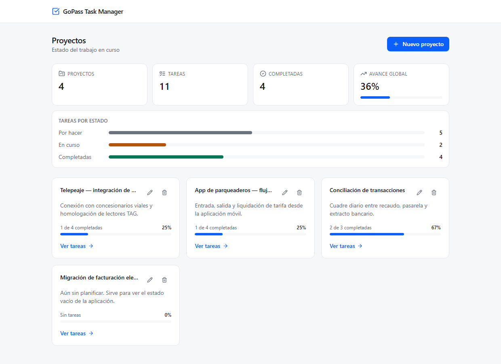
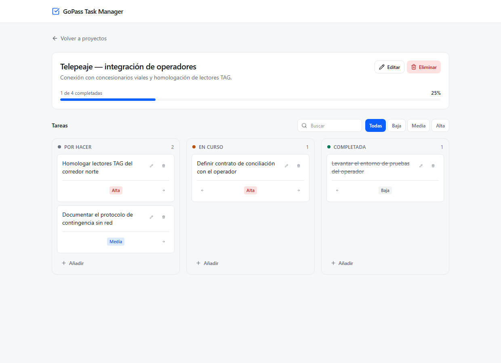

# GoPass Task Manager

Gestión de tareas por proyectos. **React 18 · Node/Express · PostgreSQL 16.**

```bash
docker compose up --build
```

Un solo requisito: Docker. Levanta la base, aplica migraciones, siembra datos de ejemplo y sirve la aplicación en **<http://localhost:5173>**.



---

## Qué hace

Crear proyectos, asociarles tareas con estado y prioridad, y ver el trabajo de forma que responda preguntas: cuánto queda, qué está en curso, qué es urgente.

| | |
|---|---|
| **Panel** | Totales, avance global y reparto de tareas por estado, agregados en la base de un solo viaje |
| **Proyectos** | Alta, edición y borrado, con barra de avance calculada en SQL |
| **Tablero** | Tres columnas por estado, con transición en un clic, búsqueda y filtro por prioridad |
| **Filtros** | Viven en la URL: un tablero filtrado se comparte por enlace y sobrevive a una recarga |



## Cinco decisiones que definen este proyecto

**1. Borrar un proyecto con tareas devuelve 409, no borra en cascada.**
La restricción es `ON DELETE RESTRICT` y la impone PostgreSQL. Prefiero un borrado que falla de forma explicable a uno que destruye trabajo en silencio.

**2. La integridad se comprueba en el motor, no en memoria.**
No se consulta «¿tiene tareas?» antes de borrar: entre ese `SELECT` y el `DELETE` cabría un `INSERT` de otra petición. Se ejecuta la operación y se traduce el error que devuelve el motor.

**3. Los dos casos de `SQLSTATE 23503` son indistinguibles.**
Medido contra PostgreSQL 16: borrar un padre con hijos e insertar un hijo sin padre devuelven el mismo `code`, `constraint`, `table`, `schema` y `routine`. Como deben responder 409 y 404, la desambiguación no puede vivir en un traductor genérico: vive en cada repositorio, que sí sabe qué operación estaba ejecutando.

**4. `completed_at` lo sella la base de datos, no la aplicación.**
Un `CHECK` verifica la invariante `DONE ⟺ completed_at IS NOT NULL` y un trigger la satisface. La prueba de que funciona es que el script de datos de ejemplo **no menciona esa columna** y sus tareas completadas la tienen. La API rechaza con 400 cualquier intento de escribirla.

**5. Sin ORM y sin librería de enrutado.**
Dos entidades no justifican una abstracción que oculta el control granular del SQL y los planes de ejecución; el patrón repositorio da el mismo aislamiento. Para el enrutado se midió el coste real de `react-router-dom` en este bundle —**+13.4 KB gzip para dos rutas**— y se resolvió con la History API.

El registro completo son **20 ADRs** en [docs/spec/04-arquitectura.md](docs/spec/04-arquitectura.md), cada uno con su contexto, sus alternativas descartadas y por qué.

## Arquitectura

```
web/   React 18 · Vite · TanStack Query · Tailwind
       Validación de formularios → experiencia de usuario
         │  HTTP · ruta relativa /api (proxy de Vite en dev, nginx en Docker)
         ▼
api/   Express · TypeScript estricto · Zod · pg
       Zod es la FRONTERA DE CONFIANZA. Errores en RFC 7807.
         │  pg (pool)
         ▼
PostgreSQL 16
       FK · CHECK · ENUM · UNIQUE · triggers · índices
       INTEGRIDAD. La última palabra.
```

Las tres capas validan cosas distintas: el formulario, para no molestar al servidor con datos incompletos; la API, porque el frontend se puede saltar con `curl`; y la base, porque la API puede tener un fallo.

Monolito modular con módulos por dominio (`projects`, `tasks`, `stats`).

## API

Doce endpoints. Errores en `application/problem+json` (RFC 7807) con un `code` estable que el frontend traduce; `X-Request-Id` en **todas** las respuestas, no solo en los fallos.

| | Ruta | |
|---|---|---|
| `GET` | `/api/health` | Estado del proceso y de la base |
| `GET` | `/api/stats` | Agregados del panel |
| `GET · POST` | `/api/projects` | Listar con avance · crear |
| `GET · PATCH · DELETE` | `/api/projects/:id` | Detalle · edición parcial · borrado (**409** si tiene tareas) |
| `GET · POST` | `/api/projects/:id/tasks` | Listar con filtros · crear |
| `GET · PATCH · DELETE` | `/api/tasks/:id` | Detalle · edición parcial · borrado |

**[docs/api.http](docs/api.http)** es una colección ejecutable: se lanza desde VS Code con REST Client o desde JetBrains y recorre el ciclo completo, incluidos todos los caminos de error. El contrato exhaustivo —payloads, catálogo de códigos y el mapeo `SQLSTATE`→HTTP— está en [docs/spec/03-contrato-api.md](docs/spec/03-contrato-api.md).

## Calidad

```
78 pruebas    69 backend (integración contra PostgreSQL real) · 7 frontend · 2 E2E
93.8 %        cobertura de líneas del backend funcional
```

Las pruebas de integración corren contra PostgreSQL de verdad, no contra un doble del driver: cada worker crea su propia base (`gopass_tasks_test_<id>`), aplica las migraciones y trunca entre casos, así que los archivos siguen ejecutándose en paralelo. Simular el driver probaría el simulador.

Los dos escenarios E2E cubren lo único que la integración no puede: que el estado venga de PostgreSQL y no de React —de ahí la recarga en mitad del flujo— y que el 409 **llegue a los ojos del usuario**, no solo al cuerpo de la respuesta.

```bash
npm run test        # backend + frontend
npm run test:e2e    # Playwright (requiere docker compose up -d db)
```

El [pipeline de CI](.github/workflows/ci.yml) ejecuta lint, typecheck, las pruebas contra un PostgreSQL real, ambos builds, los E2E y un quality gate. Estrategia completa y matriz de trazabilidad de los 16 requisitos en [docs/spec/05-estrategia-calidad.md](docs/spec/05-estrategia-calidad.md).

## Desarrollo fuera de contenedores

```bash
npm run install:all      # raíz, api/ y web/
cp .env.example .env
docker compose up -d db  # solo la base
npm run dev              # api en :3000, web en :5173
```

El cliente pide siempre a `/api`, una ruta relativa: la reenvía el proxy de Vite en desarrollo y nginx en Docker. No hay configuración de CORS por ambiente ni URL de backend dentro del bundle.

| Comando | |
|---|---|
| `npm run reset` | Rehace la base desde cero con los datos de ejemplo |
| `npm run migrate` · `npm run seed` | Migraciones y datos por separado |
| `npm run lint` · `npm run typecheck` | Lo mismo que ejecuta CI |

## Alcance

Se acotó de forma explícita y por escrito **antes** de empezar. Los requisitos, con sus criterios de aceptación y la lista de lo descartado con su razón, están en [docs/spec/01-requisitos.md](docs/spec/01-requisitos.md).

Fuera de alcance: **autenticación y roles** (no están en el enunciado y traen consigo un modelo de identidad completo), **drag & drop** (alto coste en accesibilidad y reordenamiento persistente para una señal puramente visual), **paginación** (no aporta a este volumen; el umbral a partir del cual sería obligatoria está documentado), **borrado lógico y auditoría** (sin requisito de trazabilidad, contaminan todas las consultas) y **fechas de vencimiento**.

Límites conocidos del diseño actual: en edición concurrente gana la última escritura —con concurrencia real entraría una columna `version` y un 412—, y reasignar una tarea a otro proyecto existe en la API pero todavía no en la interfaz.

## Documentación

| | |
|---|---|
| [Requisitos y trazabilidad](docs/spec/01-requisitos.md) | RF y RNF con criterios de aceptación; qué queda fuera y por qué |
| [Modelo de dominio](docs/spec/02-modelo-dominio.md) | DDL completo, invariantes y decisiones de modelado |
| [Contrato de API](docs/spec/03-contrato-api.md) | Endpoints, errores RFC 7807, mapeo `SQLSTATE`→HTTP |
| [Arquitectura](docs/spec/04-arquitectura.md) | Capas, estructura y los 20 ADRs |
| [Estrategia de calidad](docs/spec/05-estrategia-calidad.md) | Pruebas, CI, quality gates y matriz de trazabilidad |
| [Verificación de PostgreSQL](docs/spec/08-verificacion-postgres.md) | Mediciones contra el motor que decidieron el modelo de datos |
| [Desarrollo asistido por IA](docs/process/ai-assisted-development.md) | Cómo se trabajó y qué se verificó |

## Stack

TypeScript estricto en ambos extremos (`noUncheckedIndexedAccess`, `exactOptionalPropertyTypes`). Express 4 · Zod · `pg` · `node-pg-migrate` · PostgreSQL 16 · React 18 · Vite 6 · TanStack Query 5 · Tailwind 4 · Vitest · Supertest · Playwright · Docker Compose · GitHub Actions.
