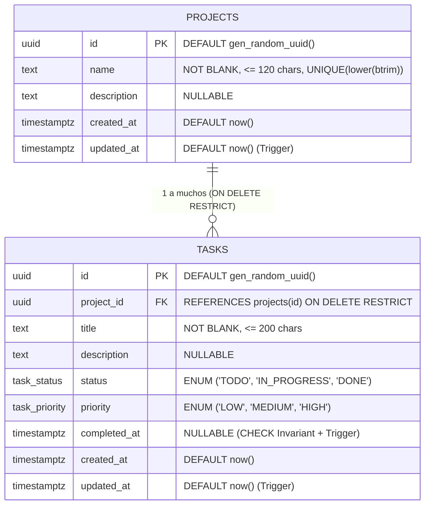

# Design: SL-02 — Arquitectura DDL, Mapeador de Errores y Middleware RFC 7807

## Diagrama Entidad-Relación y Restricciones



## Estructura de Respuesta RFC 7807 (`ProblemDetails`)

```json
{
  "type": "https://gopass-task-manager.local/errors/project-has-tasks",
  "title": "El proyecto tiene tareas asociadas",
  "status": 409,
  "code": "PROJECT_HAS_TASKS",
  "detail": "No se puede eliminar un proyecto que todavía tiene tareas. Elimínalas primero.",
  "instance": "/api/projects/5b1f0a10-0000-4000-8000-000000000001",
  "requestId": "6a9e1e82-3d71-4a55-b4c6-2182b8ff4e29"
}
```
