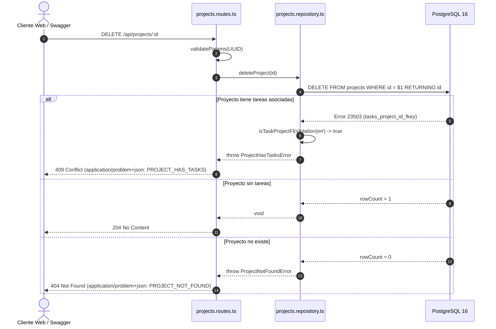

# Design: SL-03 — Endpoints de Proyectos, Métricas y Swagger UI

## Diagrama de Secuencia de Borrado Atómico

```mermaid
sequenceDiagram
    autonumber
    actor Cliente as Cliente Web / Swagger
    participant Router as projects.routes.ts
    participant Repo as projects.repository.ts
    participant PG as PostgreSQL 16

    Cliente->>Router: DELETE /api/projects/:id
    Router->>Router: validateParams(UUID)
    Router->>Repo: deleteProject(id)
    Repo->>PG: DELETE FROM projects WHERE id = $1 RETURNING id
    alt Proyecto tiene tareas asociadas
        PG-->>Repo: Error 23503 (tasks_project_id_fkey)
        Repo->>Repo: isTaskProjectFkViolation(err) -> true
        Repo-->>Router: throw ProjectHasTasksError
        Router-->>Cliente: 409 Conflict (application/problem+json: PROJECT_HAS_TASKS)
    else Proyecto sin tareas
        PG-->>Repo: rowCount = 1
        Repo-->>Router: void
        Router-->>Cliente: 204 No Content
    else Proyecto no existe
        PG-->>Repo: rowCount = 0
        Repo-->>Router: throw ProjectNotFoundError
        Router-->>Cliente: 404 Not Found (application/problem+json: PROJECT_NOT_FOUND)
    end
```
