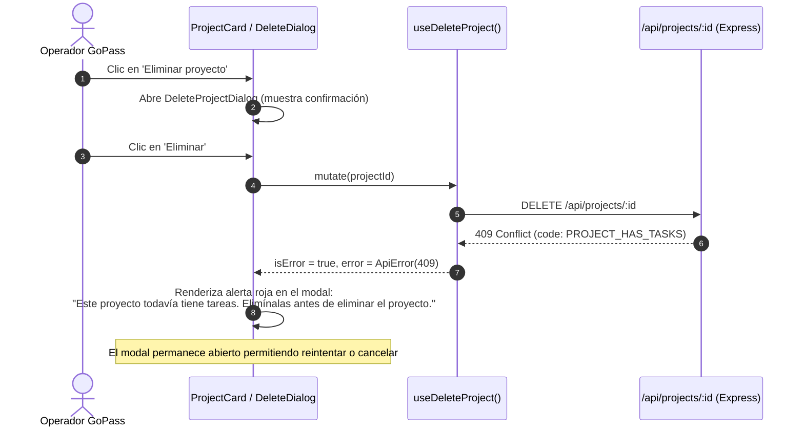

# Design: SL-04 — Arquitectura de Componentes y Flujo de Diálogo 409

## Flujo de Interacción Modal de Borrado con Error 409

```mermaid
sequenceDiagram
    autonumber
    actor Usuario as Operador GoPass
    participant UI as ProjectCard / DeleteDialog
    participant Hook as useDeleteProject()
    participant API as /api/projects/:id (Express)

    Usuario->>UI: Clic en 'Eliminar proyecto'
    UI->>UI: Abre DeleteProjectDialog (muestra confirmación)
    Usuario->>UI: Clic en 'Eliminar'
    UI->>Hook: mutate(projectId)
    Hook->>API: DELETE /api/projects/:id
    API-->>Hook: 409 Conflict (code: PROJECT_HAS_TASKS)
    Hook-->>UI: isError = true, error = ApiError(409)
    UI->>UI: Renderiza alerta roja en el modal:<br/>"Este proyecto todavía tiene tareas. Elimínalas antes de eliminar el proyecto."
    Note over UI: El modal permanece abierto permitiendo reintentar o cancelar
```
