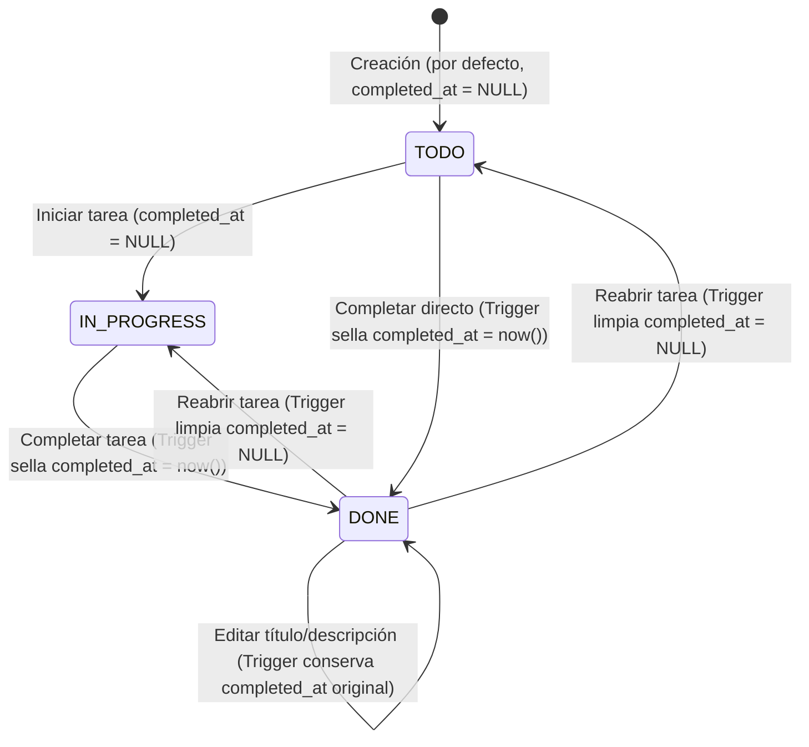

# Design: SL-05 — Arquitectura de Tareas y Diagrama de Estados

## Máquina de Estados de la Tarea

```mermaid
stateDiagram-v2
    [*] --> TODO: Creación (por defecto, completed_at = NULL)
    TODO --> IN_PROGRESS: Iniciar tarea (completed_at = NULL)
    IN_PROGRESS --> DONE: Completar tarea (Trigger sella completed_at = now())
    TODO --> DONE: Completar directo (Trigger sella completed_at = now())
    DONE --> IN_PROGRESS: Reabrir tarea (Trigger limpia completed_at = NULL)
    DONE --> TODO: Reabrir tarea (Trigger limpia completed_at = NULL)
    DONE --> DONE: Editar título/descripción (Trigger conserva completed_at original)
```
