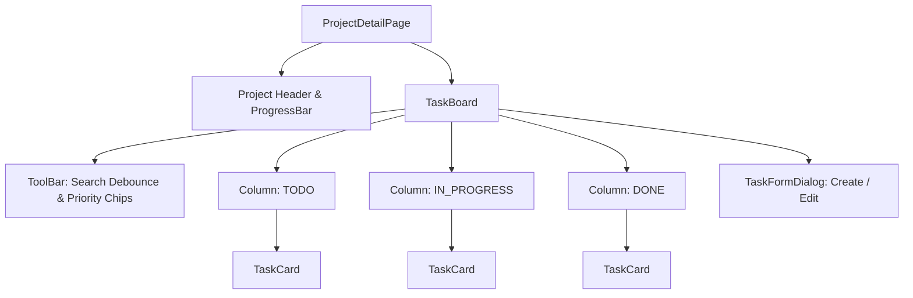

# Design: SL-06 — Arquitectura de Componentes del Tablero Kanban

```mermaid
graph TD
    PDP[ProjectDetailPage] --> H[Project Header & ProgressBar]
    PDP --> TB[TaskBoard]
    TB --> TBH[ToolBar: Search Debounce & Priority Chips]
    TB --> C1[Column: TODO]
    TB --> C2[Column: IN_PROGRESS]
    TB --> C3[Column: DONE]
    C1 --> TC1[TaskCard]
    C2 --> TC2[TaskCard]
    C3 --> TC3[TaskCard]
    TB --> TFD[TaskFormDialog: Create / Edit]
```
