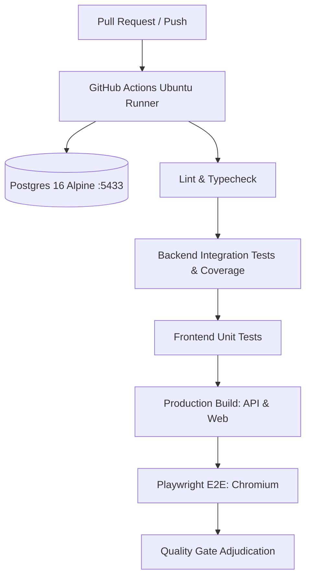

# Design: SL-07 — Arquitectura del Pipeline de CI

```mermaid
graph TD
    PR[Pull Request / Push] --> Runner[GitHub Actions Ubuntu Runner]
    Runner --> DB[(Postgres 16 Alpine :5433)]
    Runner --> Step1[Lint & Typecheck]
    Step1 --> Step2[Backend Integration Tests & Coverage]
    Step2 --> Step3[Frontend Unit Tests]
    Step3 --> Step4[Production Build: API & Web]
    Step4 --> Step5[Playwright E2E: Chromium]
    Step5 --> Step6[Quality Gate Adjudication]
```
