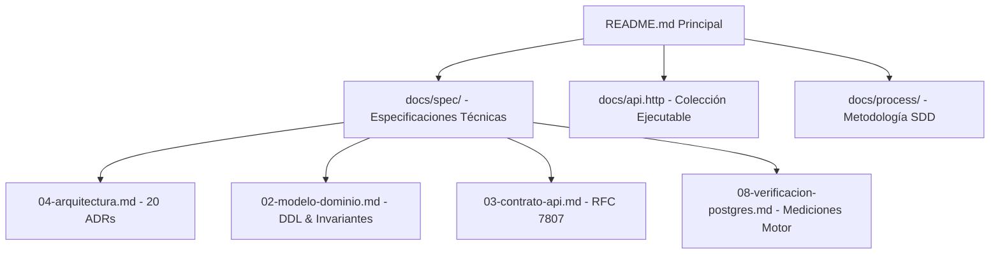

# Design: SL-08 — Estructura Documental y Navegabilidad

```mermaid
graph TD
    README[README.md Principal] --> SPEC[docs/spec/ - Especificaciones Técnicas]
    README --> HTTP[docs/api.http - Colección Ejecutable]
    README --> PROC[docs/process/ - Metodología SDD]
    SPEC --> ADR[04-arquitectura.md - 20 ADRs]
    SPEC --> DOMAIN[02-modelo-dominio.md - DDL & Invariantes]
    SPEC --> API[03-contrato-api.md - RFC 7807]
    SPEC --> PG[08-verificacion-postgres.md - Mediciones Motor]
```
